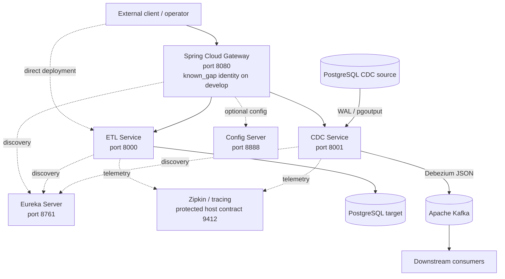
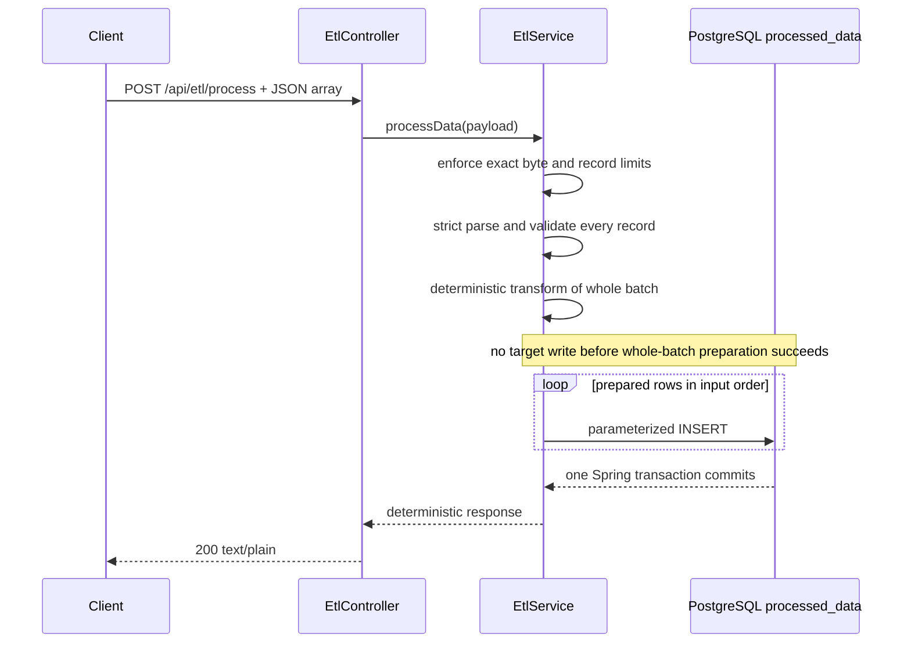
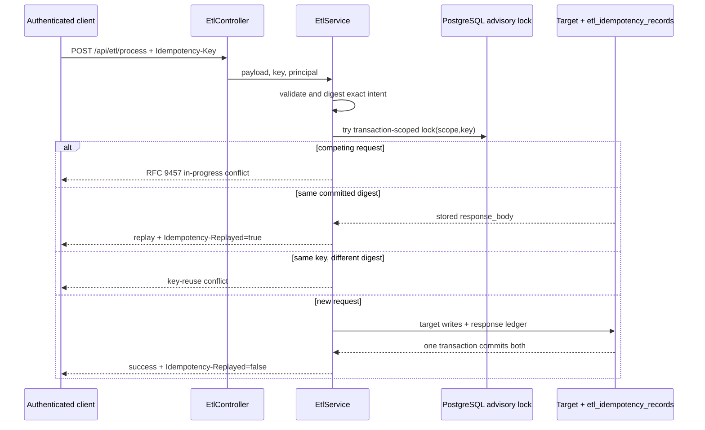
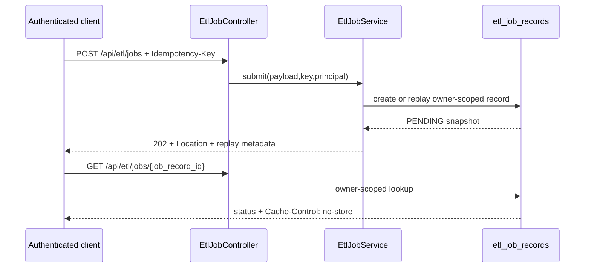
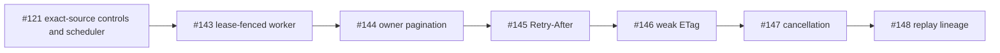
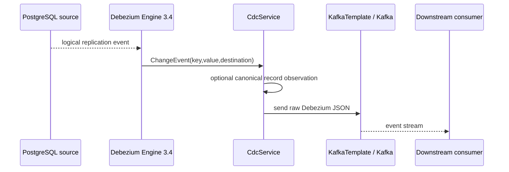
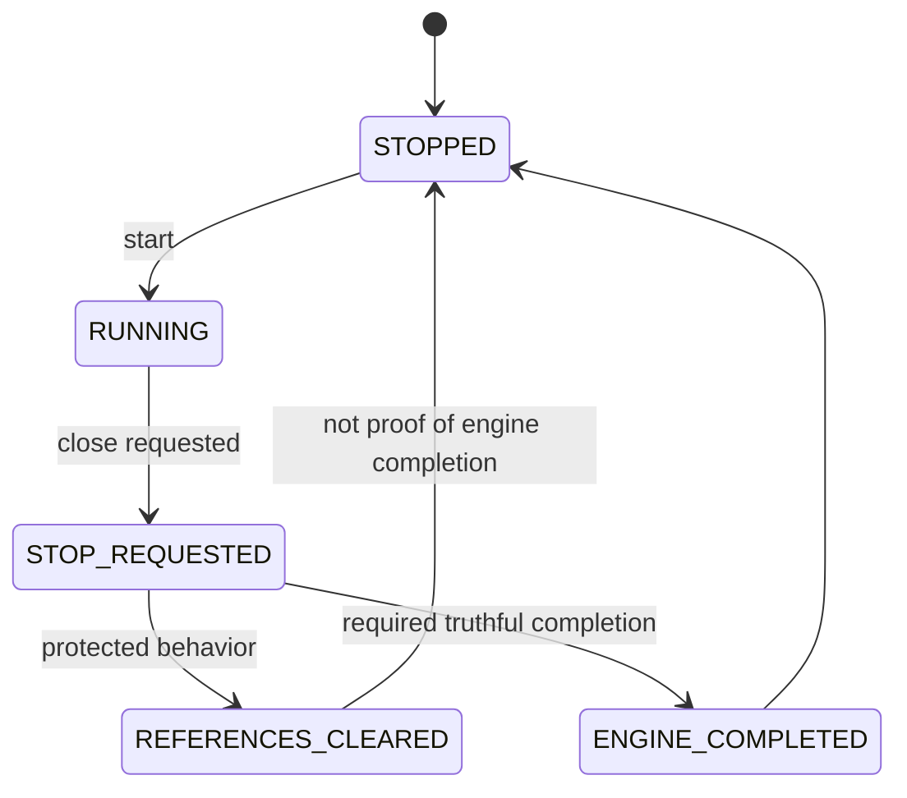
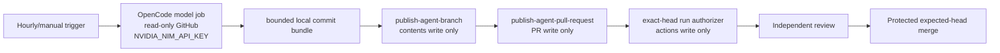
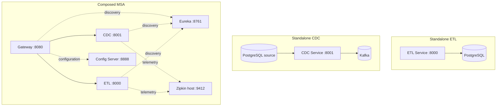

# mightyETL System Architecture

**Canonical protected baseline:** `develop@622e5e6c3d534f230c390f10e3832efadfc01825`  
**Last reconciled:** 2026-08-10

This document describes protected `develop` first, then overlays open work with explicit maturity labels. An `active_pr`, `planned`, or `known_gap` statement is not deployed product truth.

## 1. Architecture Status Vocabulary

- `implemented_on_develop` — exact protected-baseline reality.
- `active_pr` — open pull request only.
- `planned` — accepted issue/design without protected implementation.
- `superseded` — historical path, no longer an integration target.
- `out_of_scope` — intentionally excluded.
- `known_gap` — protected behavior with a material limitation.

## 2. High-Level Component Architecture

The service decomposition preserves standalone operation. Composition adds routing, discovery, configuration, and observability; it does not erase service, identity, data, or failure boundaries.

## 3. ETL Service Architecture — `implemented_on_develop`

### 3.1 ETL Processing Flow

The earlier per-record `CompletableFuture`/`Parallel Proc` architecture is retired. A later failure rolls back the batch rather than leaving a committed prefix.

### 3.2 Principal-scoped idempotency

Raw principals and raw idempotency keys are not stored in `etl_idempotency_records`.

### 3.3 Durable asynchronous intake

`EtlJobController` is `implemented_on_develop` but disabled by default. It provides intake and owner-scoped status, not a claim that a protected background worker is running.

Protected status values are `PENDING`, `RUNNING`, `SUCCEEDED`, and `FAILED`. The schema requires active rows to retain `request_payload` and terminal rows to clear it, but protected `develop` has no integrated worker. Indefinite pending-payload retention is therefore a `known_gap` when intake is enabled.

## 4. Durable Job Active Stack — `active_pr`

The arrows are exact ancestry/dependency contracts. Checks, reviews, and approvals do not transfer when a predecessor changes.

## 5. CDC Event Capture Flow

Protected develop does not await Kafka broker acknowledgement before returning from `handleChangeEvent`; this is a `known_gap`. PR #139 is the `active_pr` bounded acknowledgement path. Issue #141 owns graceful stop because protected `stop()` can clear references before the asynchronous Debezium task has returned and flushed progress.

## 6. Connector Architecture

`TargetConnectorDispatcher` owns ETL target lifecycle and catalog behavior. The protected primary load path remains PostgreSQL. `CdcSourceRegistry`, `CdcTargetRegistry`, and canonical record interfaces are extensibility surfaces, but protected capture remains PostgreSQL Debezium → Kafka and reports `anyToAny=false`.

A connector is commercially supported only when its configured path is executable, secured, observable, documented, compatibility-tested, and release-accepted. A scaffold is removed from production discovery or productionized; it is not advertised indefinitely.

## 7. Persistence Architecture

Physical and conceptual relationships are in `docs/ERD.md`.

### 7.1 `implemented_on_develop`

- `processed_data` — local PostgreSQL ETL target.
- `etl_idempotency_records` — principal/key-hash replay ledger.
- `etl_job_records` — durable asynchronous intake/status state with a runtime retention `known_gap`.
- legacy `users`, `roles`, and `user_roles` — bootstrap compatibility objects, not a shipped registration/login system.

### 7.2 `active_pr` and planned overlays

The #143→#148 stack adds lease, pagination, cancellation, and replay-lineage state. PR #155 removes abandoned local-auth objects from clean installs while preserving explicit upgrade compatibility. No active migration is protected truth until integration.

## 8. Security Architecture

### 8.1 Gateway and direct service identity

Protected `JwtAuthenticationFilter` accepts the literal example value `valid_token`. This is a `known_gap`, not cryptographic JWT validation. PR #142 is the `active_pr` Spring Security Resource Server replacement.

The default deployment can also reach ETL directly at port 8000. Gateway identity therefore does not establish direct/east-west ETL identity; issue #161 remains a separate product/security gap.

Historical local authentication is retained only as superseded traceability:

- superseded interface: `POST /auth/signin`
- superseded interface: `POST /auth/signup`
- superseded security claim: `BCrypt` password authentication

### 8.2 Purpose-bound data protection

Principal hashes, payloads, connector credentials, SQL, DLT records, backup bundles, and privileged diagnostics are protected operational data. mightyETL uses purpose-bound authorization, encryption, least privilege, bounded retention, deletion/export controls, auditable privileged access, and stable non-leaking public errors instead of blanket masking that destroys ETL utility.

## 9. Automation Authority Architecture — `active_pr` #121

The model cannot publish, approve, merge, or release. Deterministic publishers receive no model credential. Branch publication verifies exact predecessor/base, bounded paths/commits, ancestry, and post-write SHA; branch-wide parent binding prefers Git Data commit construction and non-forced ref update. A branch-local conflict freezes only that branch.

## 10. CI and Evidence Architecture

Protected `pull_request` CI uses GitHub's generated merge ref unless a workflow explicitly checks out and asserts the contributor head. Synthetic integration evidence is useful but does not replace literal source evidence. PR #121 adds literal-head CI/SBOM controls; issue #196 requires a complete resolved Maven dependency graph; issue #162 and PR #164 require non-empty selected-class coverage; issue #205 requires repository-wide owned-production scope.

Checks, statuses, scanners, SBOMs, reviews, model judgments, merge decisions, artifacts, and protected-runtime observations remain separate evidence authorities.

## 11. Monitoring and Observability

- Micrometer observations decorate ETL/job/CDC control surfaces.
- CDC status exposes configured/runtime state without secrets.
- Protected Compose documents Zipkin host port 9412; PR #167 is the active internal-9411 transport repair.
- OpenTelemetry semantic conventions are preferred for new cross-service telemetry.
- Metric dimensions remain finite; principals, jobs, payloads, secrets, SQL, and raw diagnostics do not become uncontrolled labels.

## 12. Deployment Architecture

A composed topology cannot make an independently useful service depend on an unrelated component unless an accepted ADR changes that product boundary.

## 13. Runtime and Supply-Chain Architecture

Tracked binaries, mutable remote scripts, duplicate launch delegates, ambiguous Java versions, container images, Maven dependencies, and runtime identifiers are supply-chain and compatibility authorities. PR #169 removes unsafe repository launch paths; issue #168 owns tracked-binary follow-through; PR #191 inventories product/runtime/state identifiers before migration. SBOM and scanner success require complete materialization and exact artifact/source identity.

## 14. Data and Recovery Domains

PostgreSQL transactions protect only participating PostgreSQL writes. Kafka, Debezium offsets, DLT, object storage, remote warehouses, and APIs are external effects unless a connector proves atomicity, idempotency, or compensation. PR #208 is the active provenance-bound PostgreSQL backup/restore path; it does not prove application readiness, external-side-effect reconciliation, or measured RPO/RTO.

## 15. Cross-Cutting Authority Model

### 15.1 Service and configuration identity authority

ADR-0010 governs independent gateway, direct ETL, CDC control, Eureka, Config Server, operator, database, broker, and connector boundaries. No boundary inherits another's authentication. Discovery and network placement are not authorization. Protected placeholder/basic/anonymous paths remain `known_gap` or `active_pr` until runtime tests and protected operational evidence pass.

### 15.2 Schema mutation and recovery authority

ADR-0009 makes Flyway the sole production schema-mutation authority. PR #184 and PR #208 remain active implementation evidence. Migration history, backup manifests, restore rehearsal, destructive-loss recovery, application invariants, external effects, and measured RPO/RTO are separate acceptance layers.

### 15.3 Diagnostic, dead-letter, and data-lifecycle authority

ADR-0011 separates stable non-sensitive public diagnostics from privileged evidence. Dead-letter records are terminal quarantine and require explicit access, encryption, retention, deletion, residency, redrive authorization, and lineage. ADR-0014 keeps tenant authority unresolved but explicit; principal scoping must not be documented as tenant isolation.

### 15.4 Evidence, review, and release authority

ADR-0012 separates source head, PR-base snapshot, live base, synthetic merge, workflow checkout, coverage, dependency graph, scanner, SBOM, formal review, merge, artifact provenance, licensing, and protected-runtime evidence. A green aggregate does not authorize merge or release unless every applicable subject-specific gate is complete and non-vacuous.

## 16. Architecture Decision Index

Canonical decisions are indexed in `docs/adr/README.md`. A change to public API, persisted state, trust, lifecycle, deployment, autonomous authority, compatibility, data governance, recovery, or evidence semantics updates the relevant ADR and traceability in the same integration path.

## 17. References

Debezium. (2026). *Debezium Engine 3.4*. Debezium Documentation. https://debezium.io/documentation/reference/3.4/development/engine.html

GitHub. (2026). *Events that trigger workflows*. GitHub Docs. https://docs.github.com/en/actions/reference/workflows-and-actions/events-that-trigger-workflows

OpenTelemetry Authors. (2025). *Semantic conventions*. OpenTelemetry. https://opentelemetry.io/docs/concepts/semantic-conventions/
