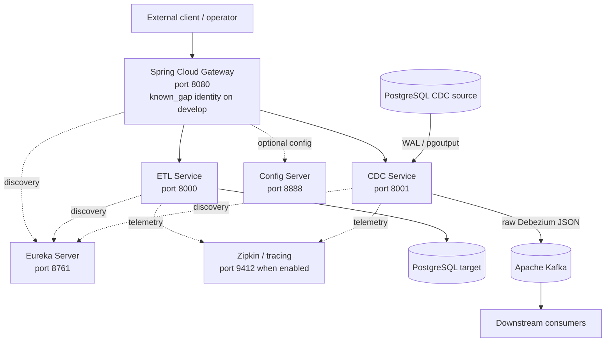
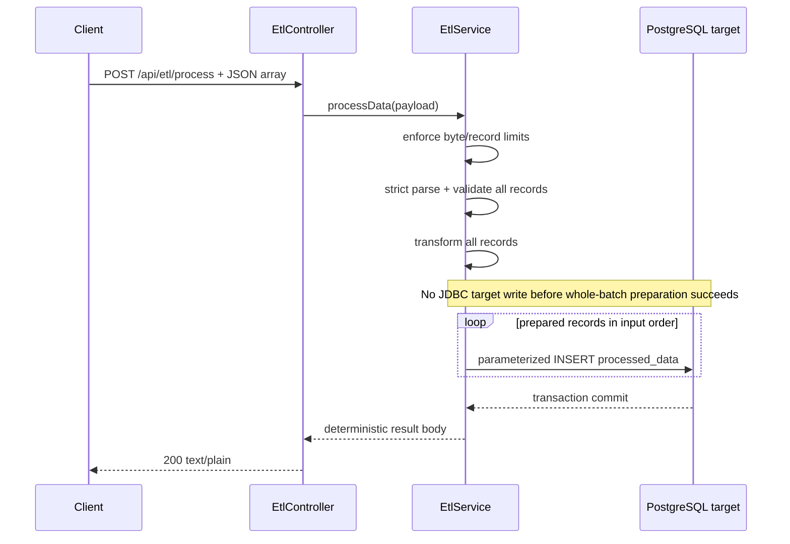
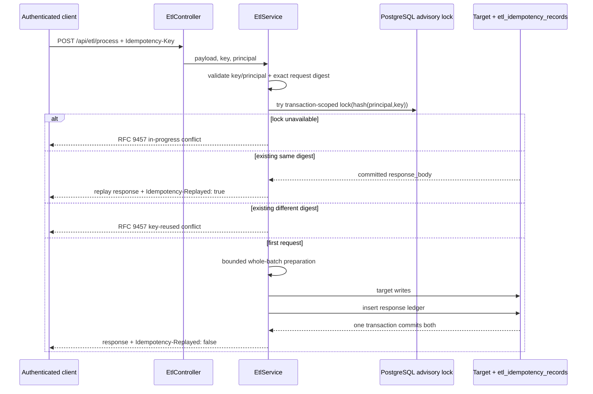
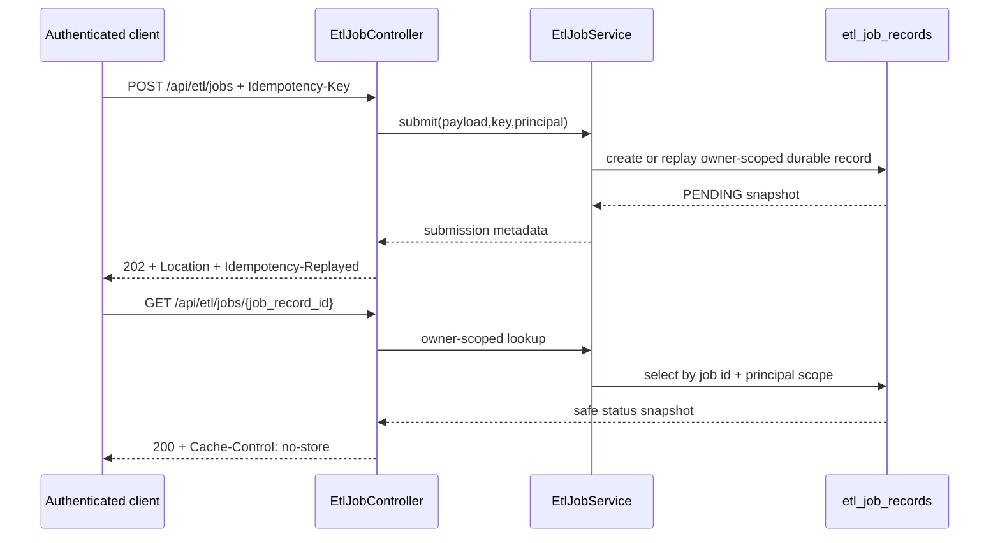
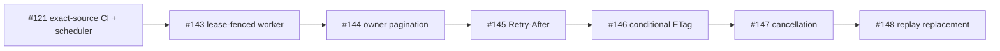
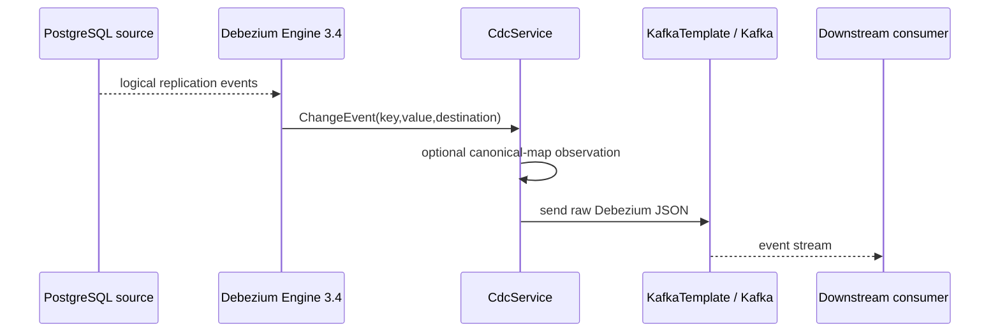
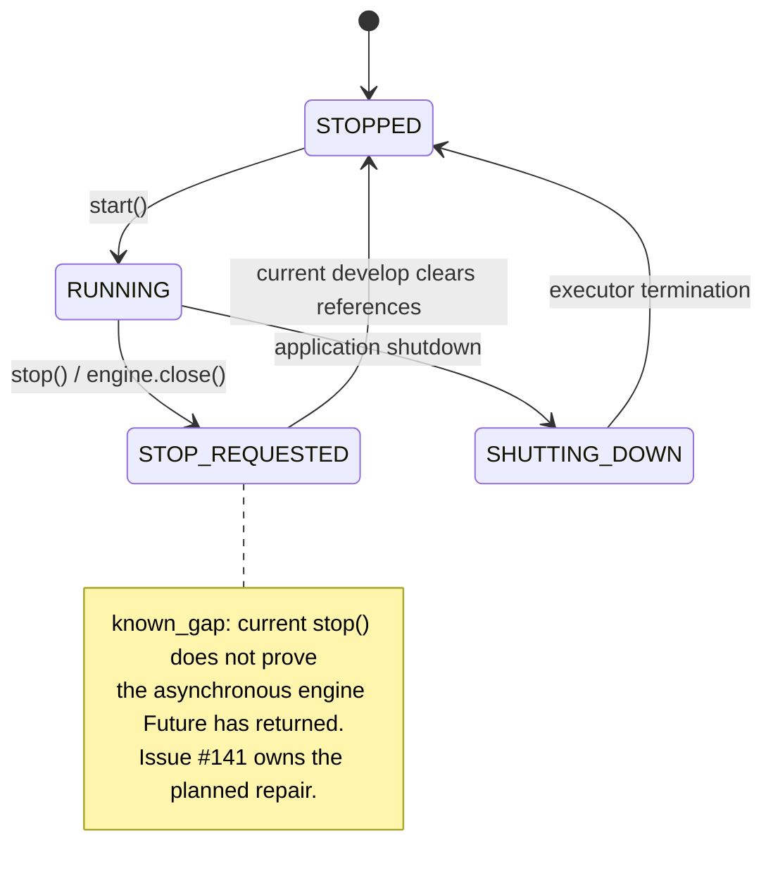
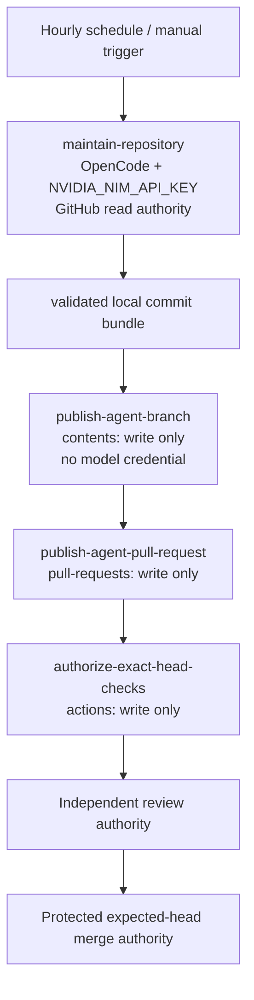
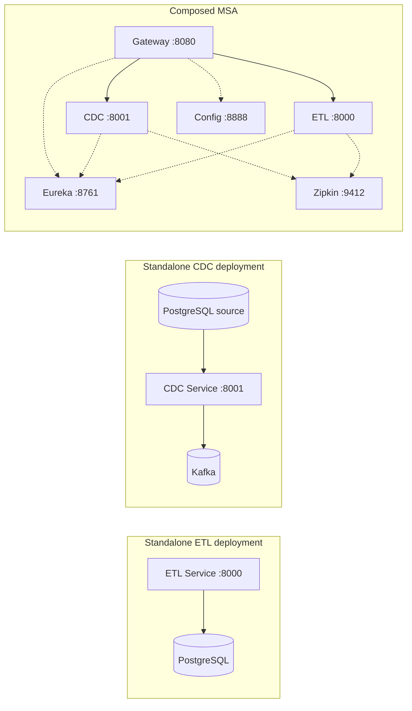

# mightyETL System Architecture

**Canonical protected baseline:** `develop@622e5e6c3d534f230c390f10e3832efadfc01825`  
**Last reconciled:** 2026-08-09

This document describes the architecture that actually exists on protected `develop`, then overlays open work with an explicit `active_pr` label. A diagram containing an active PR is not a statement that the feature is deployed.

## 1. Architecture Status Vocabulary

- `implemented_on_develop` — protected baseline reality.
- `active_pr` — open PR only.
- `planned` — issue/design, no protected implementation.
- `superseded` — historical path, not an integration target.
- `out_of_scope` — intentionally excluded.
- `known_gap` — protected behavior with a material limitation.

## 2. High-Level Component Architecture

The service decomposition is compatible with independent operation: an ETL-only deployment does not need a CDC engine, and a CDC deployment does not require an unused warehouse connector. Composition adds routing/discovery/observability; it does not erase service boundaries.

## 3. ETL Service Architecture — `implemented_on_develop`

### 3.1 ETL Processing Flow

The earlier per-record `CompletableFuture`/`Parallel Proc` architecture is retired. The live path is synchronous inside one Spring transaction so a later failure rolls back the batch rather than leaving committed prefix records.

### 3.2 Principal-scoped idempotency Flow

Raw principals and raw idempotency keys are not stored in `etl_idempotency_records`.

### 3.3 Durable job intake Flow

`EtlJobController` is `implemented_on_develop` but disabled by default. It is deliberately an intake/status boundary, not a claim of background execution.

On protected develop the job status domain is `PENDING`, `RUNNING`, `SUCCEEDED`, `FAILED`. The request payload remains retained for active states because the worker/terminal clearing behavior is not yet integrated.

## 4. Durable Job Active Stack — `active_pr`

The arrow is a dependency/ancestry contract, not a release promise. Every predecessor integration can invalidate downstream base/evidence and requires fresh direct-base validation. These capabilities remain `active_pr` until protected merge.

## 5. CDC Event Capture Flow

### 5.1 `implemented_on_develop`

`known_gap`: protected develop does not wait for Kafka broker acknowledgement in `handleChangeEvent`. PR #139 is the `active_pr` acknowledged-delivery path and adds a finite acknowledgement wait/retry boundary before Debezium record progress.

### 5.2 CDC lifecycle

Debezium documents `close()` as a graceful stop request and `run()` as returning only after remaining events and offset flushing complete. Therefore future operator state must distinguish request-to-stop from proven task completion.

## 6. Connector Architecture

### 6.1 ETL target connectors

`TargetConnectorDispatcher` owns target connector lifecycle/catalog behavior. The protected product's primary load path remains PostgreSQL. Warehouse/BI connector surfaces are useful discovery/configuration scaffolds, but support claims must follow runtime capability rather than documentation aspiration.

### 6.2 CDC source/target SPI

`CdcSourceRegistry`, `CdcTargetRegistry`, `CdcSourceFactory`, and the canonical record mapping surface allow future source/target evolution. The live capture path remains PostgreSQL Debezium → Kafka. `getStatus()` explicitly reports `anyToAny=false` on the protected baseline.

## 7. Persistence Architecture

Detailed relationships are in `docs/ERD.md`.

### 7.1 `implemented_on_develop`

- `processed_data` — local compose primary ETL target.
- `etl_idempotency_records` — principal/key-hash replay ledger.
- `etl_job_records` — durable asynchronous intake/status state.
- legacy local compose `users`, `roles`, `user_roles` — persisted bootstrap compatibility objects, not a shipped registration/login service.

### 7.2 `active_pr`

The durable-job stack adds lease, pagination-index, cancellation, and replay-lineage persistence in later PRs. These objects belong in the active-PR overlay of `docs/ERD.md` until integrated.

## 8. Security Architecture

### 8.1 Gateway identity

Protected develop has a class named `JwtAuthenticationFilter`, but its `validateToken` implementation accepts the literal example value `valid_token`. That is a `known_gap`, not production JWT validation.

PR #142 is `active_pr` and replaces this with Spring Security reactive OAuth 2.0 Resource Server JWT configuration. Until protected integration, the architecture makes no issuer/JWK/audience/algorithm claim.

Historical architecture described local auth and password hashing. These identifiers are retained only as superseded traceability:

- superseded interface: `POST /auth/signin`
- superseded interface: `POST /auth/signup`
- superseded security claim: `BCrypt` password authentication

The local compose `password` column is legacy data shape and does not turn the superseded HTTP/authentication design into a shipped capability.

### 8.2 ETL owner/idempotency boundary

Authenticated `Principal` values are used to scope keyed requests and durable job lookup. Stored identities are one-way domain-separated hashes; client responses and ordinary telemetry exclude raw principal/key/payload/internal diagnostics.

### 8.3 PII policy

mightyETL must remain usable for legitimate enterprise data movement, so it does not require blanket PII masking. Controls are purpose-bound authorization, encryption, least privilege, minimal retention, auditable privileged access, and non-leaking logs/error/metric metadata.

## 9. Automation Authority Architecture — `active_pr` #121

Protected develop does **not** yet run this scheduler. The intended separation is documented so its security properties are reviewable before integration.

Core invariants:

- the model job does not get repository write, review, or merge authority;
- deterministic publishers get no model credential;
- branch publication verifies exact predecessor/base, policy paths, commit/file bounds, ancestry, and post-write SHA;
- branch-wide expected-parent publication prefers Git Data commit construction plus non-forced `force=false` ref update;
- a branch-local writer conflict freezes only that branch for the invocation;
- review and merge remain independent.

## 10. CI / Evidence Architecture

### 10.1 Protected develop today

The current `CI` workflow uses ordinary `actions/checkout` with no explicit pull-request head ref. GitHub documents that `pull_request` workflows use `GITHUB_REF=refs/pull/<n>/merge`, and checkout uses that ref by default. Therefore a green source-executing job on protected develop can describe the generated merge preview rather than the literal PR head.

This is useful compatibility evidence, but it is not accepted as literal-head proof where the repository's exact-source governance requires that identity.

### 10.2 `active_pr` #121

#121 adds explicit head checkout plus exact-SHA verification for source-executing CI/SBOM and carries a separate central-scanner dependency for literal-head hard scanning. `synthetic-merge` evidence remains non-substitutable.

## 11. Monitoring and Observability

- Micrometer observations decorate key ETL/job/CDC control surfaces.
- CDC status exposes configured/runtime state and replication-slot information without secrets.
- Zipkin is the currently documented tracing backend when enabled.
- New cross-service telemetry should use OpenTelemetry semantic conventions where suitable.
- Metric dimensions must remain finite; resource/job/principal/secret identifiers do not become uncontrolled labels.

## 12. Deployment Architecture

No composed topology may make an independently useful service impossible to run without an unrelated component unless an explicit ADR changes that product principle.

## 13. Architecture Decision Index

The canonical decision records are indexed in `docs/adr/README.md`. Architecture changes that alter API, persisted state, trust, lifecycle, deployment, autonomous authority, or evidence semantics require an ADR status update in the same PR.

## 14. References

Debezium. (2026). *Debezium Engine 3.4*. Debezium Documentation. https://debezium.io/documentation/reference/3.4/development/engine.html

GitHub. (2026). *Events that trigger workflows*. GitHub Docs. https://docs.github.com/en/actions/reference/workflows-and-actions/events-that-trigger-workflows

OpenTelemetry Authors. (2025). *Semantic conventions*. OpenTelemetry. https://opentelemetry.io/docs/concepts/semantic-conventions/
