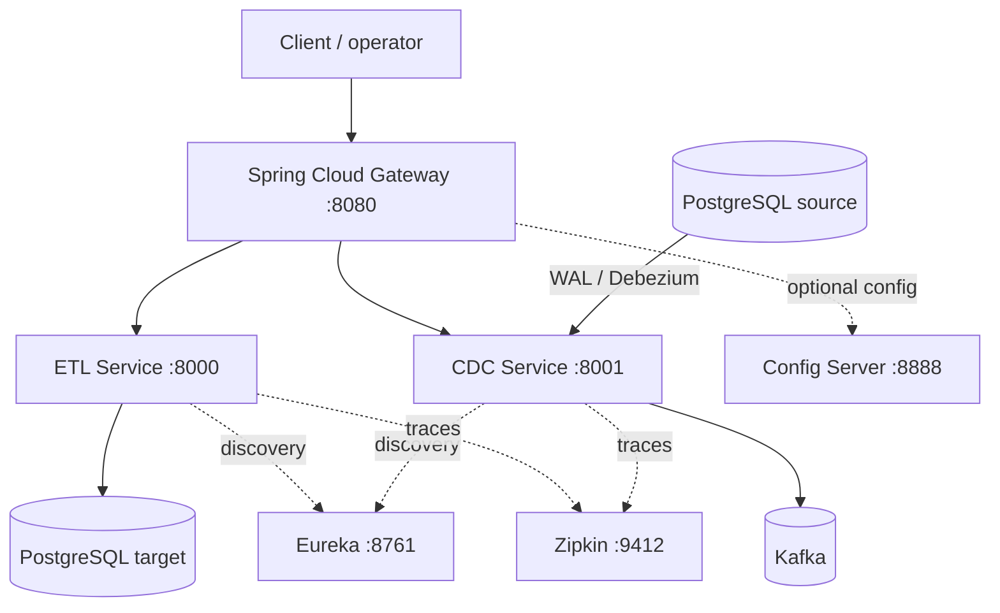

# mightyETL — Enterprise ETL and CDC Platform

mightyETL is a modular Spring-based data-movement platform for **bounded atomic ETL**, **durable retry/job state**, and **PostgreSQL change data capture**. It can be operated as standalone ETL/CDC services or composed behind Gateway/Eureka/Config/observability infrastructure.

> **Formerly xtrmETL.** Product-facing naming is **mightyETL**. Java packages (`com.xtrmetl.*`), Maven coordinates, and some configuration/topic defaults remain legacy compatibility surfaces; see [docs/rebrand-name-matrix.md](docs/rebrand-name-matrix.md).

## Product truth first

This README distinguishes protected `develop` behavior from open work. Canonical status definitions and detailed traceability live in [PRD.md](PRD.md), [ARCHITECTURE.md](ARCHITECTURE.md), and [docs/TRACEABILITY.md](docs/TRACEABILITY.md).

| Capability | Current status | Notes |
| --- | --- | --- |
| Bounded atomic `POST /api/etl/process` | **implemented_on_develop** | Full batch validated/transformed before first JDBC write; one Spring transaction |
| Principal-scoped `Idempotency-Key` | **implemented_on_develop** | PostgreSQL try-lock + durable response ledger; raw principal/key not persisted |
| Durable `POST /api/etl/jobs` + owner status | **implemented_on_develop, opt-in** | Intake/status only on protected develop; disabled by default |
| Durable worker / pagination / polling / ETag / cancellation / replay | **active_pr** | Repaired stack #143 → #148; not shipped yet |
| PostgreSQL Debezium → Kafka CDC | **implemented_on_develop** | Raw Debezium JSON live path; replay-tolerant semantics |
| Kafka acknowledgement before source progress | **active_pr #139** | Protected develop still submits Kafka send without awaiting broker acknowledgement |
| Truthful graceful CDC stop completion | **planned issue #141** | Protected `stop()` clears task references before proving async engine completion |
| Gateway production JWT Resource Server | **active_pr #142** | Protected gateway still has the `valid_token` example-token placeholder |
| PostgreSQL ETL target | **implemented_on_develop** | Primary production load path |
| Databricks / Snowflake / Qlik | **scaffold** | Discovery/configuration surfaces only; do not market as production loaders |
| Literal-head CI/SBOM + hourly NVIDIA OpenCode maintenance | **active_pr #121** | Protected develop still uses default PR checkout semantics |

**Do not market active PRs, scaffolds, or historical reverse-engineering designs as shipped capability.**

## Architecture



The full MSA is composable, not mandatory. An ETL-only deployment can run without CDC/Kafka; a CDC-only deployment can run without the ETL service. See [ARCHITECTURE.md](ARCHITECTURE.md) and [docs/UML.md](docs/UML.md).

## Quick Start

### Prerequisites

- Java 25
- Maven Wrapper included in the repository
- PostgreSQL for ETL target/durable state
- PostgreSQL logical replication + Kafka for CDC
- Docker/Compose only when using the provided composed development environment

### Build and test

```bash
./mvnw -B test
```

The repository quality contract requires exact 100% configured owned-production statement/branch coverage and complete public production documentation before protected merge. See [docs/TEST_STRATEGY.md](docs/TEST_STRATEGY.md).

### Docker Compose development environment

```bash
docker compose up --build
```

The compose files contain development defaults. Override database credentials and use deployment secret management in production.

### ETL database environment

```bash
export PGHOST=localhost
export PGPORT=5432
export PGUSER=your_username
export PGPASSWORD=your_password
export PGDATABASE=your_database
```

Optional ETL admission bounds:

```bash
export ETL_MAX_PAYLOAD_BYTES=1048576
export ETL_MAX_BATCH_RECORDS=1000
```

### CDC logical-replication prerequisite

Example PostgreSQL settings:

```ini
wal_level = logical
max_replication_slots = 4
max_wal_senders = 4
```

Set source database/Kafka/CDC environment according to [docs/cdc/ops-and-reliability.md](docs/cdc/ops-and-reliability.md). Do not delete/reset offset state as a generic retry strategy.

## Services

### ETL Service — port 8000

Protected-develop public surfaces:

- `POST /api/etl/process` — bounded atomic synchronous processing;
- `GET /api/etl/connectors` — connector catalog/runtime support state;
- `POST /api/etl/jobs` — opt-in durable asynchronous intake;
- `GET /api/etl/jobs/{job_record_id}` — opt-in owner-scoped status (implementation variable is `jobRecordId`).

Key behavior:

- exact UTF-8 byte and record-count limits;
- strict JSON parsing/validation before target writes;
- deterministic uppercase/lowercase/decimal transformations;
- one transaction for accepted synchronous rows;
- retry only for transient data-access failures;
- RFC 9457 typed failure responses;
- optional principal-scoped idempotency with `Idempotency-Replayed` evidence;
- durable intake disabled by default until deliberately enabled by the operator.

Detailed contracts:

- [bounded atomic batches](docs/etl/bounded-atomic-batches.md)
- [idempotent retries](docs/etl/idempotent-retries.md)
- [problem details](docs/api/problem-details.md)
- [durable job intake](docs/etl/durable-job-intake.md)
- [canonical API contract](docs/API_CONTRACT.md)

### CDC Service — port 8001

Protected-develop surfaces:

- `POST /api/cdc/start`
- `POST /api/cdc/stop`
- `GET /api/cdc/status`
- `GET /api/cdc/sources`
- `GET /api/cdc/targets`

The live path is PostgreSQL Debezium → Kafka. Optional canonical mapping/SPI support is not the live publication format and `anyToAny=false` remains an honest status value.

Two reliability boundaries remain explicit:

1. broker acknowledgement-before-progress is **active_pr #139**;
2. stop-waits-for-engine-completion is **planned issue #141**.

See [CDC operations](docs/cdc/ops-and-reliability.md).

### Gateway — port 8080

**Security warning:** protected `develop` does not currently provide production cryptographic JWT validation. `JwtAuthenticationFilter` accepts only the literal example `valid_token`. Do not expose this as a production identity boundary.

PR #142 is the active replacement using Spring Security reactive OAuth 2.0 Resource Server JWT plus a fail-closed deny mode. The historical `/auth/signup` and `/auth/signin` examples are **superseded design notes, not current APIs**.

See [SECURITY.md](SECURITY.md), [docs/THREAT_MODEL.md](docs/THREAT_MODEL.md), and [ADR-0005](docs/adr/0005-gateway-identity-boundary.md).

### Eureka Server — port 8761

Service discovery/registration for composed deployments.

### Config Server — port 8888

Optional configuration-service scaffold. Current services continue to support local YAML/environment configuration.

### Zipkin — port 9412

Tracing backend when enabled. New cross-service telemetry should remain compatible with OpenTelemetry semantic conventions where appropriate.

## Synchronous ETL example

```bash
curl -X POST http://localhost:8000/api/etl/process \
  -H 'Content-Type: application/json' \
  -d '[{"id":"record_alpha","name":"jane smith","email":"JANE@COMPANY.COM","amount":"999.99"}]'
```

When keyed processing is used, the runtime must supply an authenticated principal; do not invent an example bearer token from the protected gateway placeholder.

## Durable job intake example

The controller is disabled by default. Enable it only after reviewing [docs/etl/durable-job-intake.md](docs/etl/durable-job-intake.md) and understanding that protected develop has **no background worker**.

A first accepted request uses:

```http
POST /api/etl/jobs
Idempotency-Key: "550e8400-e29b-41d4-a716-446655440000"
Content-Type: application/json
```

and returns `202 Accepted`, `Location`, `Cache-Control: no-store`, and replay metadata.

## Connector support

PostgreSQL is the current production ETL load path. Warehouse/BI and additional CDC connectors use explicit SPI/catalog state so discovery is not confused with production support. A connector may be promoted only after credentials/configuration, realistic integration, failure/idempotency semantics, operability/rollback, and release evidence are complete.

See [docs/connectors/](docs/connectors/) and [ADR-0007](docs/adr/0007-standalone-msa-and-connector-truth.md).

## Data model

Canonical persisted-state documentation is [docs/ERD.md](docs/ERD.md).

Protected develop includes:

- local target `processed_data`;
- `etl_idempotency_records`;
- `etl_job_records`;
- legacy compose `users`, `roles`, `user_roles` objects.

The last three legacy-auth objects do not imply a shipped authentication API. Single-word `users` and `roles` also violate the current descriptive multi-word database naming policy and require a safe removal/rename migration plan rather than silent mutation.

## Security, privacy, and PII

mightyETL does **not** require blanket masking of legitimate business payloads. Instead use purpose-bound authorization, least-privilege credentials, encrypted transport/storage as deployment appropriate, minimum retention, auditable privileged access/exports, tenant/owner isolation where owned by the product, and non-leaking logs/errors/metrics.

Never commit `.env` files, secrets, private keys, bearer tokens, or production database credentials. See [SECURITY.md](SECURITY.md).

## Autonomous maintenance and GitHub evidence

PR #121 carries the intended hourly OpenCode maintenance topology:

- model job: repository/GitHub read authority only;
- deterministic isolated branch/PR/Actions writers;
- `NVIDIA_NIM_API_KEY` for model access;
- no GitHub Copilot / `COPILOT_GITHUB_TOKEN` development agent;
- independent review/merge authority;
- exact-source CI/SBOM identity controls;
- branch-local writer leases and non-forced branch-wide CAS publication.

Until #121 merges, those workflow controls are **active_pr**, not protected runtime. The external ChatGPT scheduler may orchestrate work, but protected repository workflow behavior is determined only by merged workflow source.

## Documentation map

- [PRD](PRD.md)
- [TRD](TRD.md)
- [Architecture](ARCHITECTURE.md)
- [UML](docs/UML.md)
- [ERD](docs/ERD.md)
- [API contract](docs/API_CONTRACT.md)
- [Security](SECURITY.md)
- [Threat model](docs/THREAT_MODEL.md)
- [Test strategy](docs/TEST_STRATEGY.md)
- [Operability](docs/OPERABILITY.md)
- [Traceability](docs/TRACEABILITY.md)
- [ADR index](docs/adr/README.md)
- [Documentation assessment](docs/DOCUMENTATION_ASSESSMENT.md)
- [Korean summary](SUMMARY_KR.md)
- [Changelog](CHANGELOG.md)

## Release policy

Do not release because one PR is green. A release requires the exact integrated protected head to satisfy required CI/security/coverage, migrations/rollback, compatibility, SBOM/provenance, independent review, standalone/MSA operational smoke tests, current canonical documentation, and artifact verification.

## License

See [LICENSE](LICENSE).
