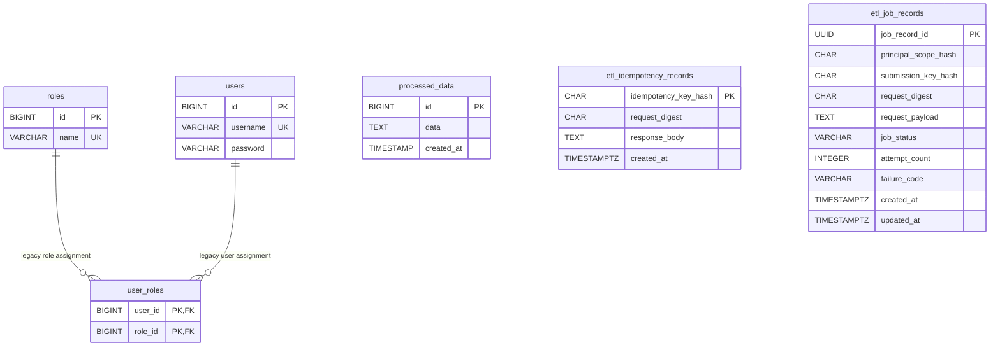
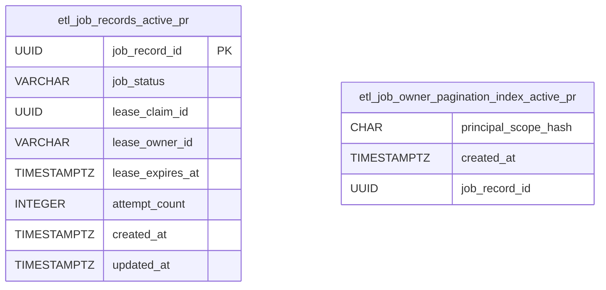
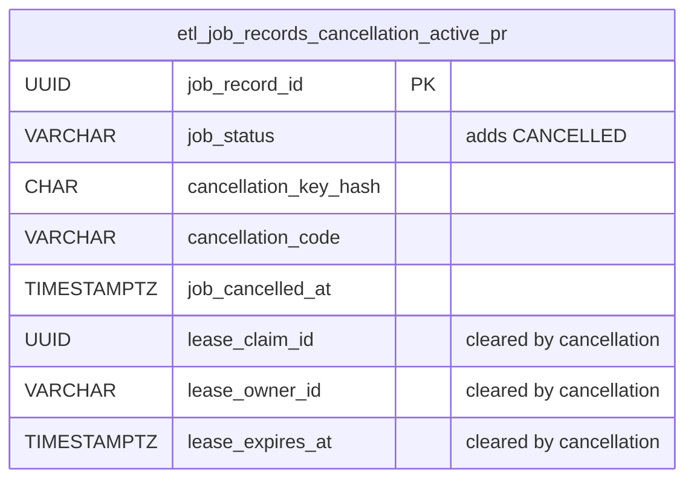

# Entity-Relationship Model

**Canonical protected baseline:** `develop@622e5e6c3d534f230c390f10e3832efadfc01825`  
**Last reconciled:** 2026-08-09

This document distinguishes physical state that exists on protected `develop` from schema extensions carried only by open pull requests. An `active_pr` entity or field is never treated as deployed persistence.

## 1. Status vocabulary

- `implemented_on_develop` — exact protected-baseline persistence.
- `active_pr` — open PR only.
- `planned` — accepted future migration or cleanup.
- `superseded` — historical schema path not intended for future integration.
- `known_gap` — persisted reality with a material governance limitation.

## 2. Protected-develop ERD — `implemented_on_develop`

There is intentionally no relational line from `etl_idempotency_records` or `etl_job_records` to `processed_data` on the protected baseline. Their association is transactional/application behavior, not a foreign-key relationship.

## 3. Physical-table notes

### `processed_data` — `implemented_on_develop`

The local compose bootstrap creates this target table and synchronous `EtlService` inserts transformed payload text using a parameterized statement. It is a two-word snake_case object and conforms to the current naming policy.

### `etl_idempotency_records` — `implemented_on_develop`

This is the durable synchronous replay ledger. The primary key is a principal-scoped semantic idempotency hash, not a raw client key. `request_digest` binds replay to exact payload intent; `response_body` is committed in the same transaction as target writes.

### `etl_job_records` — `implemented_on_develop` schema, `known_gap` runtime retention

This table owns durable asynchronous job intake. Protected-develop status is restricted to `PENDING`, `RUNNING`, `SUCCEEDED`, `FAILED`. V2 enforces a schema invariant that active rows have `request_payload IS NOT NULL` and terminal rows have `request_payload IS NULL`; however protected `develop` has no integrated worker that transitions accepted jobs to terminal state. Therefore runtime terminal clearing is **not** a shipped protected-develop execution capability, and an enabled intake can retain a pending payload indefinitely if no worker consumes it. Durable intake remains disabled by default; production enablement must account for this `known_gap` until the worker/retention lifecycle integrates. The protected baseline does not yet contain lease, pagination, cancellation, or replay-lineage fields.

### `users`, `roles`, `user_roles` — legacy persisted compatibility state

These objects are created by the local Docker PostgreSQL bootstrap. Their existence does **not** prove a shipped sign-up/sign-in product API; source inspection finds no implemented auth controller and the gateway token filter remains a placeholder.

`users` and `roles` are single-word owned database object names and therefore violate the current descriptive two-word naming policy. They are `known_gap` legacy bootstrap objects. A future migration must either remove them if the abandoned local-auth design is confirmed unused, or migrate them to descriptive compatibility names with rollback evidence. Silent in-place rename is prohibited.

## 4. Durable-worker/pagination overlay — `active_pr` #143/#144

The repaired durable-worker and pagination stack extends `etl_job_records` with lease ownership/fencing and an owner/order pagination index. Conceptually:

The pagination index is created concurrently on the active PR and is not protected-develop DDL.

## 5. Cancellation overlay — `active_pr` #147

PR #147 extends the durable state machine and V6 migration with:

The cancellation update is owner-scoped and clears payload plus active lease state atomically with the terminal transition. These columns are `active_pr`, not `implemented_on_develop`.

## 6. Replay-lineage overlay — `active_pr` #148

The replay replacement branch builds an immutable lineage for a new derived `PENDING` job from an eligible terminal source. The exact current migration remains branch-owned and can move while the PR is active; canonical protected ERD therefore records the semantic relation without pretending branch-local field names are deployed:

Before #148 leaves Draft, this section must be reconciled against its exact migration names. Old #135 persistence evidence does not transfer to the replacement.

## 7. Data lifecycle and privacy

- raw authenticated principals and raw idempotency/cancellation keys are not stored in the durable ledgers;
- V2 constrains terminal rows to a null `request_payload`, but protected `develop` does not yet execute the worker transition that would realize terminal clearing; pending-payload lifetime is therefore a `known_gap` while intake is enabled without a worker;
- request-payload retention must become operationally bounded by an integrated worker/lifecycle or an explicit retention policy before durable intake is promoted beyond its disabled-by-default protected baseline;
- payloads, principal hashes, key hashes, lease identifiers, SQL, and internal errors are not ordinary response/metric data;
- hashes are pseudonymous internal security data, not safe public identifiers;
- external connector side effects are not represented as transactionally rolled back unless the connector participates in the same atomic boundary or provides its own tested compensation/idempotency contract.

## 8. Naming migration backlog

`planned`: evaluate removal or safe migration of legacy `users` and `roles` single-word bootstrap objects. Any migration must include clean-install, upgrade, downgrade/recovery, consumer-reference inventory, and rollback evidence.

## 9. Source of truth

Physical truth remains the checked-in SQL at the exact protected head:

- `docker/postgres/init/01_schema.sql`;
- `etl-service/src/main/resources/db/migration/V1__create_etl_idempotency_records.sql`;
- `etl-service/src/main/resources/db/migration/V2__create_etl_job_records.sql`.

Later Flyway files become canonical only when their PRs integrate into protected `develop`.
