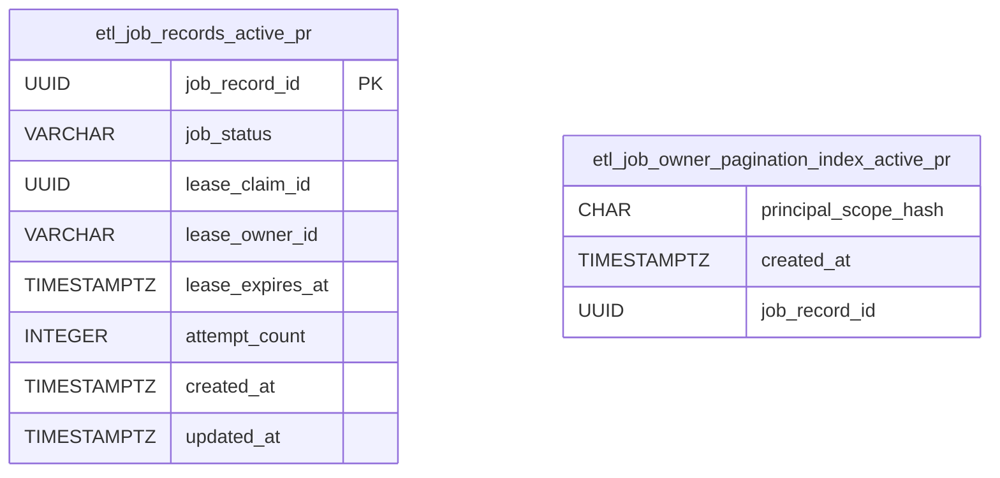
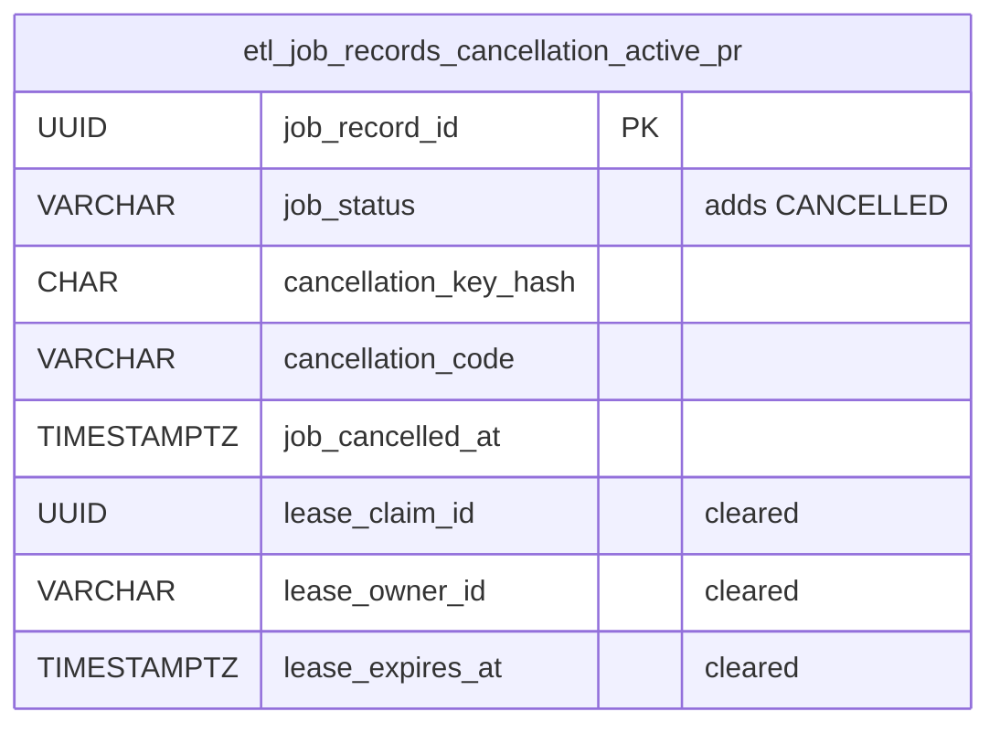
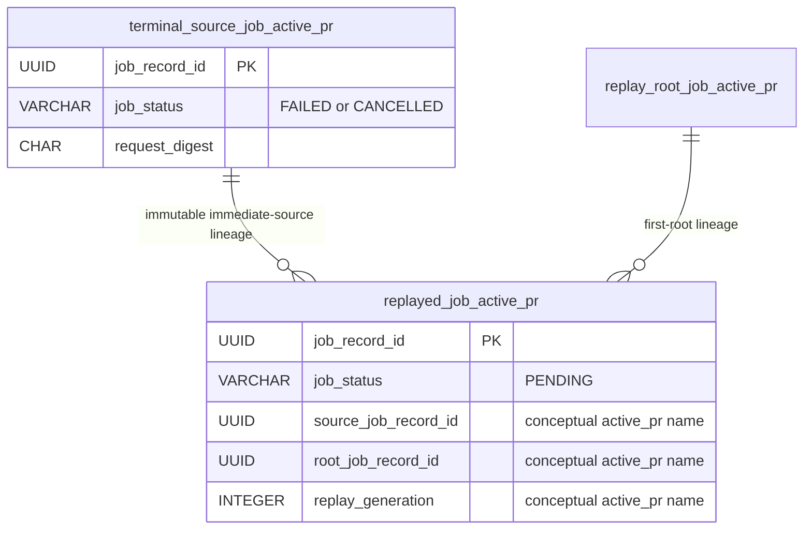
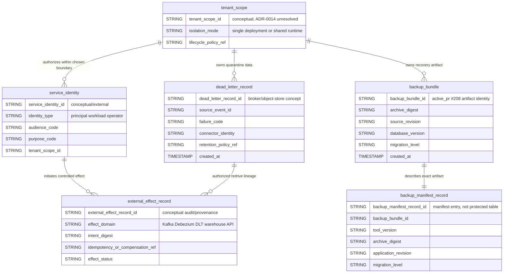

# Entity-Relationship and Logical Artifact Model

**Canonical protected baseline:** `develop@622e5e6c3d534f230c390f10e3832efadfc01825`  
**Last reconciled:** 2026-08-10

This document distinguishes relational state on protected `develop`, open-PR schema overlays, and non-relational/external artifact concepts. An `active_pr` entity or field is never treated as deployed persistence. A logical artifact is not silently converted into a PostgreSQL table.

## 1. Status vocabulary

- `implemented_on_develop` — exact protected-baseline persistence.
- `active_pr` — open PR only.
- `planned` — accepted future migration, cleanup, or model.
- `superseded` — historical schema path not intended for integration.
- `known_gap` — persisted reality with a material governance limitation.
- `conceptual_external` — logical ownership/relationship without protected relational persistence.

## 2. Protected-develop ERD — `implemented_on_develop`

There is intentionally no foreign-key line from `etl_idempotency_records` or `etl_job_records` to `processed_data`. Their relationship is transactional/application behavior, not protected relational linkage.

## 3. Physical-table notes

### `processed_data` — `implemented_on_develop`

The local Compose bootstrap creates this ETL target. `EtlService` inserts transformed payload text through a parameterized statement. The object follows the descriptive multiword snake_case policy.

### `etl_idempotency_records` — `implemented_on_develop`

This is the durable synchronous replay ledger. The primary key is a principal-scoped semantic idempotency hash, not a raw client key. `request_digest` binds replay to exact intent; `response_body` commits in the same transaction as target writes.

### `etl_job_records` — `implemented_on_develop` schema, `known_gap` runtime retention

This table owns durable asynchronous intake. Protected status is `PENDING`, `RUNNING`, `SUCCEEDED`, or `FAILED`. V2 requires active rows to retain `request_payload` and terminal rows to clear it, but protected `develop` has no integrated worker that performs terminal transitions. Terminal clearing is therefore not shipped runtime behavior, and enabled intake can retain a pending payload indefinitely. Durable intake remains disabled by default until an integrated lifecycle or explicit retention policy bounds this `known_gap`.

### `users`, `roles`, `user_roles` — legacy persisted compatibility state

These local bootstrap objects do not prove a shipped sign-up/sign-in API. `users` and `roles` violate the descriptive multiword naming policy and are `known_gap` legacy objects. PR #155 is the active clean-install retirement path; existing consumers require inventory and non-destructive compatibility evidence.

## 4. Durable worker and pagination overlay — `active_pr` #143/#144

The concurrent pagination index and lease fields are active-PR DDL, not protected relational truth.

## 5. Cancellation overlay — `active_pr` #147

Owner-scoped cancellation clears payload and active lease state atomically with the terminal transition. None of these fields is `implemented_on_develop`.

## 6. Replay-lineage overlay — `active_pr` #148

Before #148 leaves Draft, the canonical model must be reconciled with its exact migration names. Old #135 persistence evidence does not transfer.

## 7. Data lifecycle and privacy

- raw principals and raw idempotency/cancellation keys are not stored in the durable ledgers;
- pending `request_payload` lifetime is a `known_gap` without an integrated worker/retention path;
- payloads, principal/key hashes, lease identifiers, SQL, internal errors, DLT records, and backup bundles are protected operational data;
- hashes are pseudonymous identifiers, not safe public IDs;
- connector side effects are not transactionally rolled back unless the connector proves atomicity, idempotency, or compensation;
- principal scope is not tenant isolation; ADR-0014 and issue #186 keep the deployment/shared-runtime tenancy choice explicit;
- deletion, export, residency, retention, DLT, and backup policy must agree with the accepted tenant/deployment unit.

## 8. Naming and schema-authority backlog

- `planned` / `active_pr` #155: remove abandoned `users` and `roles` from clean installs while preserving explicit upgrade compatibility.
- `active_pr` #184: disable JPA production schema mutation so Flyway is the single authority.
- any migration includes clean install, upgrade, failure/recovery, consumer inventory, and rollback/forward-recovery evidence.

## 9. Relational source of truth

Physical truth remains checked-in SQL at the exact protected head:

- `docker/postgres/init/01_schema.sql`;
- `etl-service/src/main/resources/db/migration/V1__create_etl_idempotency_records.sql`;
- `etl-service/src/main/resources/db/migration/V2__create_etl_job_records.sql`.

Later Flyway files become canonical only after protected integration.

## 10. Logical external artifact model

The following model records ownership and lifecycle relationships that matter to architecture and acquisition diligence but are **conceptual or external unless a protected migration states otherwise**. It does not claim these names are PostgreSQL tables.

### 10.1 Ownership truth

- `tenant_scope` is deliberately conceptual while ADR-0014 is Proposed. Protected principal hashes do not establish it.
- `service_identity` may be issued by an external IdP, deployment, mesh, or secret system; mightyETL documents the accepted authority without inventing a local credential table.
- `backup_bundle` and `backup_manifest_record` are file/object-storage artifacts in PR #208, not protected relational rows.
- `dead_letter_record` is broker/quarantine state governed by ADR-0011; DLT payloads are terminal by default and do not automatically re-enter the normal consumer.
- `external_effect_record` expresses provenance for broker/connector/API effects that are outside the PostgreSQL transaction. It may be an audit artifact or future persisted model only after an accepted migration.

### 10.2 Promotion rule

A conceptual/external entity becomes relational truth only when an accepted ADR, checked-in migration, implementation, migration/rollback/recovery tests, Security/Threat Model/Operability updates, exact-source evidence, and protected integration agree on its owner and lifecycle. File existence, issue text, or an active PR alone cannot promote it.
