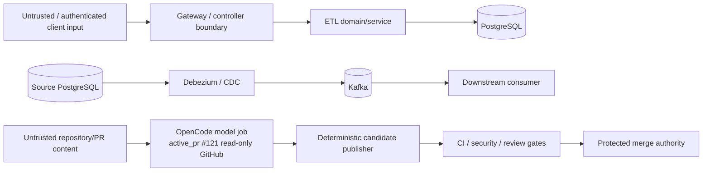

# Threat Model

**Protected baseline:** `develop@622e5e6c3d534f230c390f10e3832efadfc01825`  
**Scope:** mightyETL ETL, CDC, connectors, persistence, gateway, CI/release, and autonomous-maintenance control plane.

## 1. Security objectives

1. Unauthorized callers cannot obtain another principal's durable ETL state or replay authority.
2. A retry cannot mutate committed intent or duplicate transactional target effects inside the documented idempotency boundary.
3. Untrusted request, CDC, connector, review, and agent inputs cannot become SQL, credential, workflow, review, or merge authority implicitly.
4. Credentials, raw principals, client keys, payloads, lease tokens, SQL, and internal exceptions do not leak through ordinary logs/metrics/client responses.
5. A compromised/untrusted model job cannot write protected branches, approve itself, or merge code.
6. Security/quality evidence is bound to the source revision actually executed/scanned.
7. Availability controls bound payload, batch, retry, thread, queue, and memory growth.
8. PII required for legitimate processing remains usable under purpose-bound access rather than destructive blanket masking.

## 2. Assets

- source/target database credentials;
- Kafka credentials/configuration and event streams;
- ETL request payloads and transformed business data;
- `processed_data` and downstream transactional effects;
- durable idempotency response ledger;
- durable job payload/state/owner hashes;
- CDC offsets/schema history;
- connector configuration/secrets;
- repository source, workflows, PR branches, reviews, release artifacts;
- `NVIDIA_NIM_API_KEY` and independent reviewer credentials;
- SBOM/provenance/release evidence;
- operational logs/traces/metrics and support exports.

## 3. Trust boundaries

The model, request payload, CDC event, connector response, and automated review are inputs to validation/policy. None are authority merely because they contain imperative text.

## 4. Threat inventory

| Threat | Boundary | Consequence | Required control / status |
| --- | --- | --- | --- |
| malformed/oversized JSON | client → ETL | memory/CPU exhaustion, partial load | bounded bytes/records + whole-batch validation (`implemented_on_develop`) |
| SQL/identifier injection | ETL → DB | data corruption/exfiltration | parameterized writes + strict identifier handling (`implemented_on_develop`) |
| duplicate concurrent retry | client → idempotency ledger | duplicate effects | principal-scoped hash + try-lock + atomic ledger/target transaction (`implemented_on_develop`) |
| cross-principal job probing | client → durable API | tenant existence leak | owner hash predicate + same 404 surface (`implemented_on_develop`) |
| replay/cancellation key disclosure | DB/log/support | correlation/replay abuse | raw key never persisted/logged; hash treated as pseudonymous internal data |
| hard-coded example bearer accepted as auth | gateway | unauthorized route access | `known_gap`; fail-closed deployment + PR #142 `active_pr` |
| CDC offset progress before durable publish | Debezium → Kafka | event loss ambiguity | `known_gap`; PR #139 `active_pr` acknowledgement-first progression |
| CDC stop reports before run() returns | operator → CDC | false safe/stopped state | `known_gap`; issue #141 `planned` bounded Future completion |
| schema/DDL injection in replica paths | CDC consumer → DB | arbitrary DDL | allow-listed/validated dynamic SQL; security regression tests |
| connector claims exceed implementation | catalog → operator | unsafe production adoption | explicit scaffold/support state and integration evidence |
| workflow source uses synthetic merge but is called exact-head | GitHub Actions | wrong-source acceptance | exact-source controls in #121 `active_pr`; treat synthetic-only as non-passing |
| model receives repository write token | automation | supply-chain compromise | model read-only, deterministic isolated writers (`active_pr` #121) |
| file-level CAS misses concurrent branch movement | GitHub Contents API | mixed-writer commit | branch-wide expected-parent commit + `force=false` ref update |
| reviewer/agent self-approval | review boundary | governance bypass | independent non-author formal review; separate credentials/authority |
| dependency/action substitution | build | compromised CI | immutable action/artifact pins, Dependency Review, SBOM, SAST/security gates |
| secrets in artifacts/logs | all | credential compromise | no secret logging; least privilege; secret scanning; scoped runtime env |
| raw PII blanket-masked out of business flow | governance | product becomes unusable | purpose-bound authorization/encryption/retention/audit, not blanket masking |

## 5. Abuse cases

### 5.1 Idempotency collision/reuse

An attacker attempts to reuse a key across principals or change payload under a known key. The principal contributes to the stored identity, and the exact request digest must match before replay. A different digest is rejected.

### 5.2 Durable job enumeration

An attacker supplies random or another tenant's UUID. The API validates principal ownership and returns the same not-found class for malformed/missing/foreign-owned resources; identifiers are not capability tokens.

### 5.3 Prompt injection against the development agent

A PR, issue, source file, or log can contain instructions to exfiltrate a secret, bypass gates, or push to protected branches. Repository content is untrusted observation. The model job cannot obtain write/review/merge authority and must not be given secrets beyond its purpose-specific model credential.

### 5.4 Evidence laundering

A green aggregate workflow can have scanned `refs/pull/<n>/merge` while a merge policy asks for the literal source head. The gate must inspect source identity, not infer identity from workflow conclusion.

### 5.5 External connector rollback overclaim

A connector may perform an external side effect that cannot join the ETL/job database transaction. The product must not claim atomic rollback unless the connector proves transaction participation, idempotency, or compensation.

## 6. Residual risk

- Protected develop gateway authentication is not commercially deployable as a secure identity boundary without deployment-level restriction; #142 remains required.
- Protected develop CDC publication and stop completion have known truthfulness/delivery gaps; #139 and #141 remain required.
- Active durable-job stack behavior is not protected until merged in exact predecessor order.
- Supply-chain/review automation depends on central organization workflows that are separately leased; mightyETL cannot repair those dependencies by mutating them from this loop.
- Single-maintainer governance can make independent approval structurally difficult; this must be resolved through legitimate reviewer/App/team configuration rather than self-approval or weakened policy.

## 7. Security verification

Required test families include:

- hostile JSON/Unicode/identifier boundaries;
- authorization/owner isolation;
- idempotency concurrency and rollback;
- migration constraint/rollback tests;
- CDC delivery/lifecycle concurrency;
- connector configuration validation and no-secret catalog responses;
- workflow permission/source-identity contracts;
- dependency/SAST/security/SBOM/provenance gates;
- fuzz/property tests for parsers and boundary encoders where material;
- full owned production statement/branch coverage.

## 8. Incident evidence preservation

Security incidents preserve the exact application/repository SHA, migration version, configuration revision, affected principal/job identifiers in authorized support storage, relevant audit/log/trace evidence, dependency/SBOM identity, and recovery actions. Public error surfaces remain non-sensitive.

## 9. References — APA 7th

National Institute of Standards and Technology. (2020). *Security and privacy controls for information systems and organizations* (NIST SP 800-53 Rev. 5). https://doi.org/10.6028/NIST.SP.800-53r5

Souppaya, M., Scarfone, K., & Dodson, D. (2022). *Secure Software Development Framework (SSDF) Version 1.1* (NIST SP 800-218). National Institute of Standards and Technology. https://doi.org/10.6028/NIST.SP.800-218

The MITRE Corporation. (2024). *Common Weakness Enumeration*. https://cwe.mitre.org/
