# UML and Behavioral Diagrams

**Baseline:** `develop@622e5e6c3d534f230c390f10e3832efadfc01825`  
**Notation:** Mermaid diagram-as-code  
**Status rule:** every view distinguishes `implemented_on_develop`, `active_pr`, `planned`, and `known_gap` where ambiguity would otherwise arise.

These views complement `ARCHITECTURE.md`. They show current calls, state transitions, deployment, data/control authority, and unshipped overlays without promoting active work to protected truth.

## 1. Component View — `implemented_on_develop`

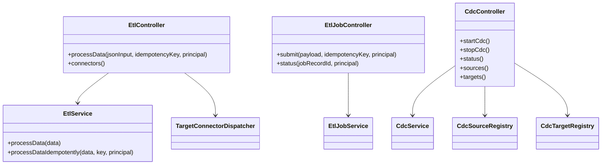

`EtlJobController` exists on protected develop but is disabled by default and provides intake/status only.

## 2. Synchronous ETL Sequence — `implemented_on_develop`

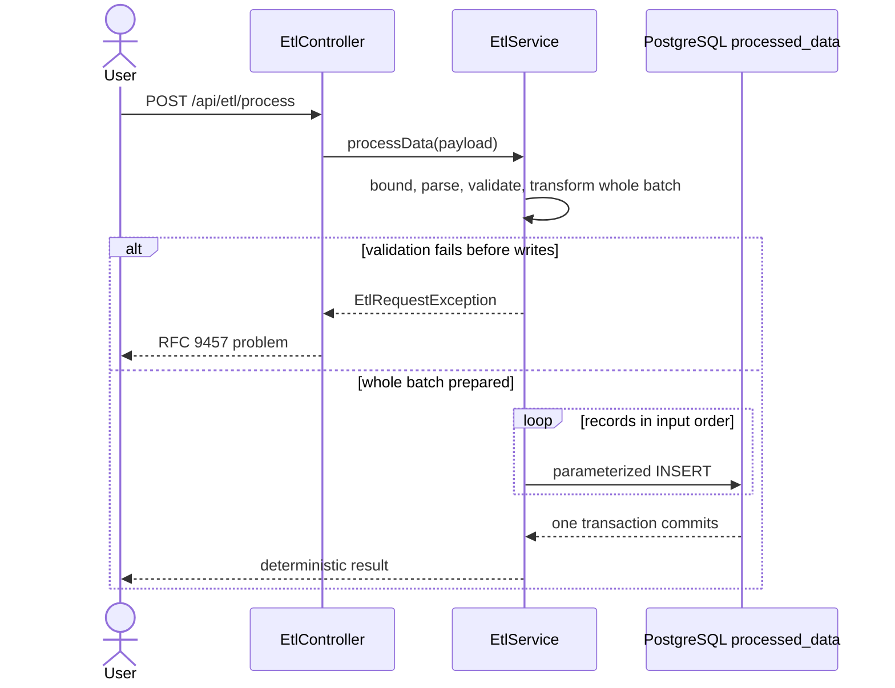

## 3. Idempotent Synchronous ETL — `implemented_on_develop`

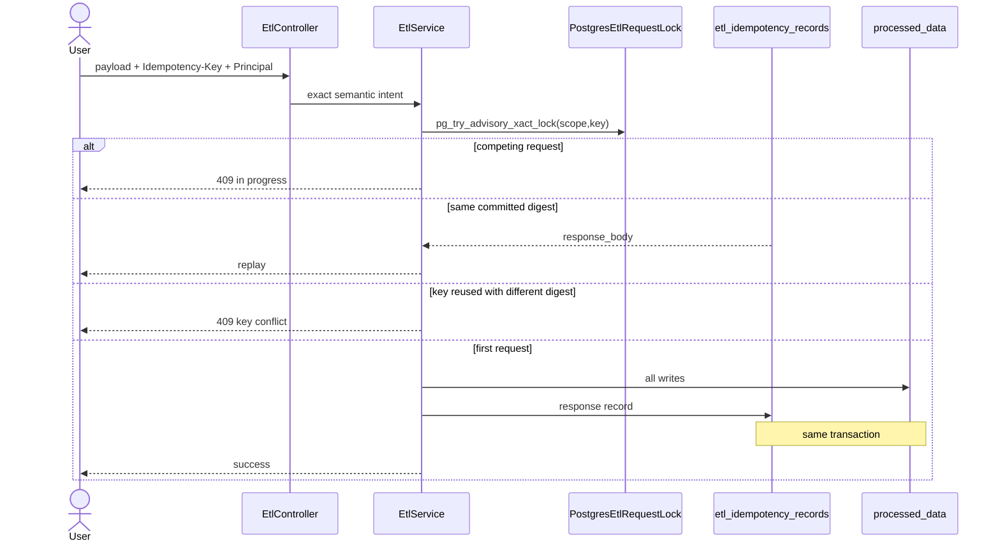

## 4. Durable Job Intake State — `implemented_on_develop`

```mermaid
stateDiagram-v2
    [*] --> PENDING: accepted intake
    PENDING --> RUNNING: schema permits; no protected worker
    RUNNING --> SUCCEEDED: schema-permitted terminal state
    RUNNING --> FAILED: schema-permitted terminal state
    PENDING --> FAILED: schema-permitted terminal state
    SUCCEEDED --> [*]
    FAILED --> [*]

    note right of PENDING
      Protected develop is intake/status only.
      Worker transitions are active_pr #143.
    end note
```

## 5. Durable Job Active-PR Evolution — `active_pr`

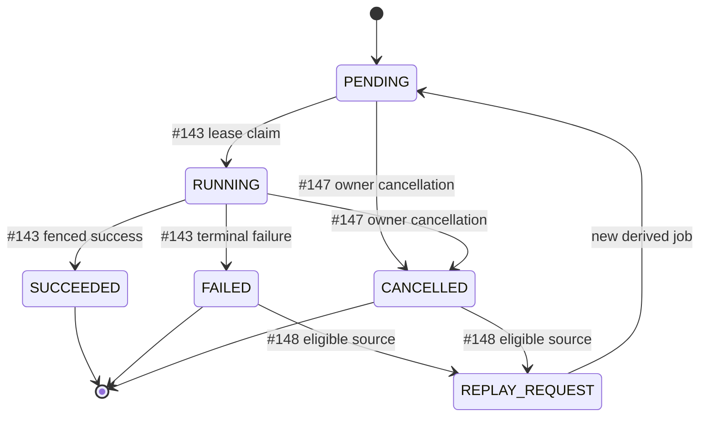

Every state or field beyond protected V2 remains `active_pr`; predecessor evidence does not transfer.

## 6. Durable Polling and Conditional Status — `active_pr`

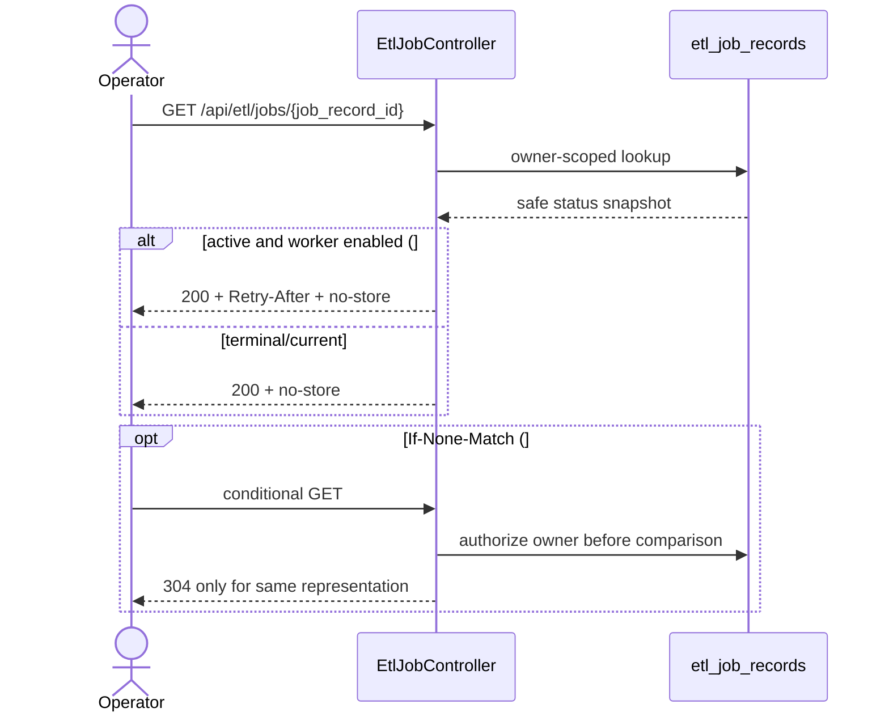

## 7. CDC Capture — `implemented_on_develop` + `known_gap`

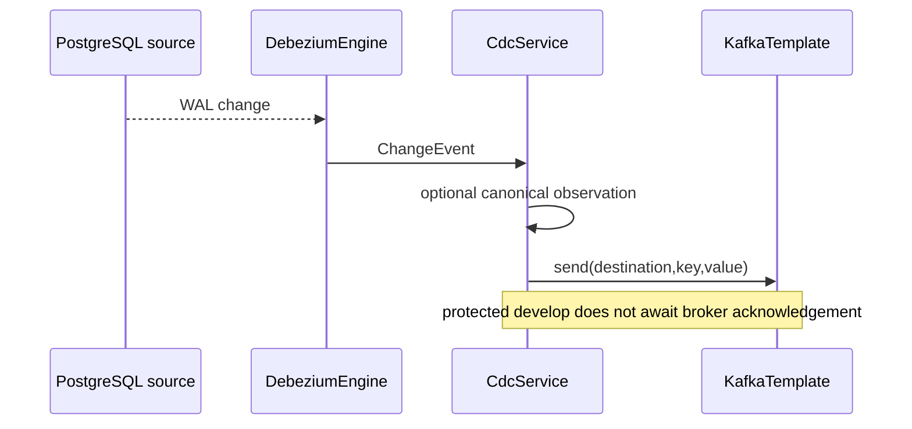

PR #139 is the `active_pr` acknowledgement-before-progress repair.

## 8. CDC Stop State — `known_gap` / `planned`

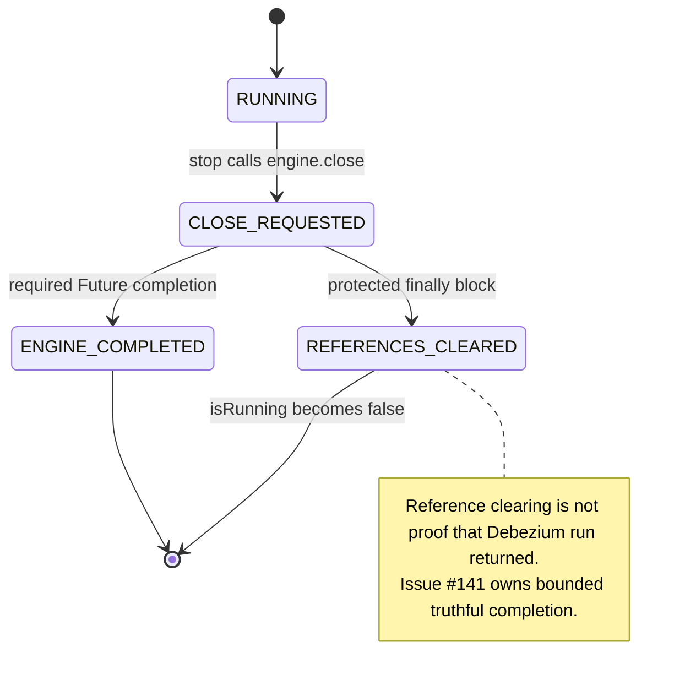

## 9. Gateway Trust State — `known_gap` / `active_pr`

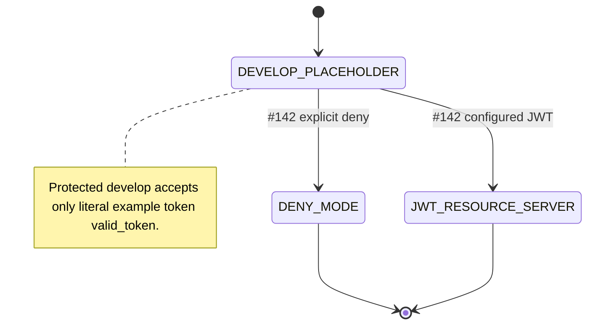

## 10. Deployment View — `implemented_on_develop`

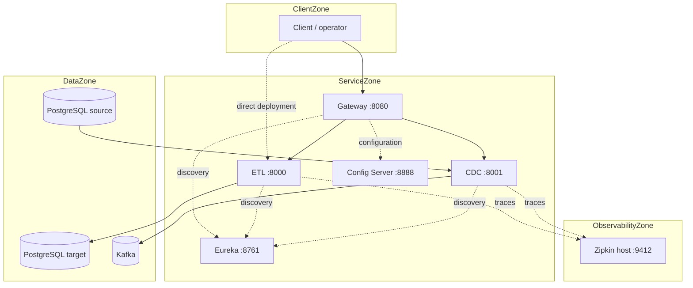

Standalone ETL and standalone CDC remain valid deployment shapes.

## 11. Autonomous Development Authority — `active_pr` #121

```mermaid
sequenceDiagram
    participant Scheduler as Hourly/manual trigger
    participant Model as OpenCode model job
    participant Branch as Deterministic branch publisher
    participant Pull as Deterministic PR publisher
    participant Actions as Exact-head run authorizer
    participant Reviewer as Independent reviewer
    participant Merge as Protected merge authority

    Scheduler->>Model: inspect/test/create bounded local commits
    Model-->>Branch: digest-bound bundle; no GitHub write
    Branch->>Branch: verify parent, paths, commits, ancestry
    Branch-->>Pull: non-forced feature ref
    Pull-->>Actions: one validated Draft PR
    Actions-->>Reviewer: unchanged exact-head evidence
    Reviewer-->>Merge: formal non-author decision
    Merge->>Merge: rulesets, gates, expected head
```

`NVIDIA_NIM_API_KEY` belongs only to model execution. Review and merge are not model capabilities.

## 12. Branch-Writer Compare-and-Swap — operating design

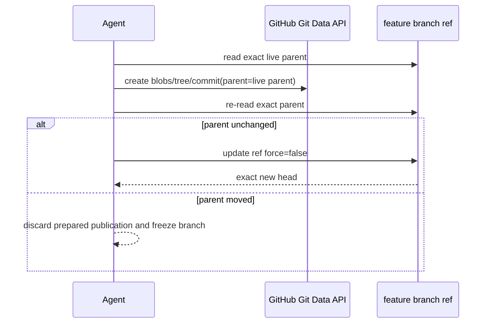

File-level blob checks do not by themselves establish branch-wide parent CAS.

## 13. Service and configuration identity authority

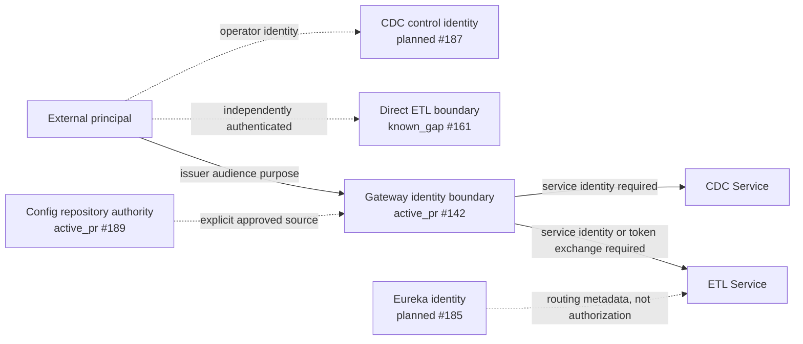

No arrow inherits authentication from another arrow. Principal, workload, operator, and tenant authority remain separate.

## 14. Schema and recovery authority

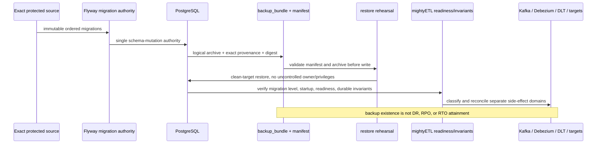

PR #184 and PR #208 are `active_pr`; this diagram is governing target architecture, not shipped behavior.

## 15. Dead-letter lifecycle authority

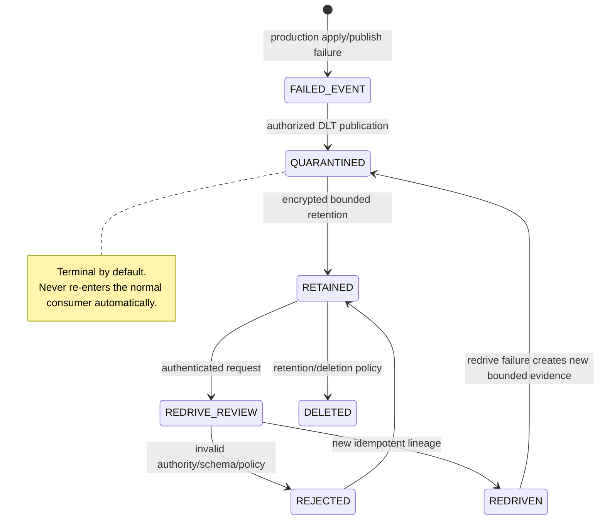

Payload/header access, encryption, retention, export, deletion, residency, and redrive are explicit data-governance controls.

## 16. Evidence and release authority

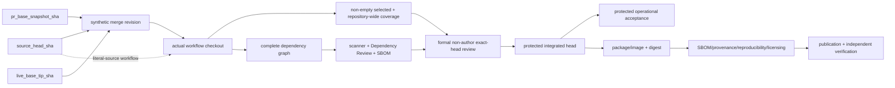

No single green node substitutes for another. Synthetic integration, literal source, formal review, protected runtime, artifact, legal/licensing, and publication evidence remain separate authorities.
