# UML and Behavioral Diagrams

**Baseline:** `develop@622e5e6c3d534f230c390f10e3832efadfc01825`  
**Notation:** Mermaid diagram-as-code  
**Status rule:** every diagram is labeled `implemented_on_develop`, `active_pr`, `planned`, or `known_gap` where ambiguity could otherwise arise.

These diagrams complement `ARCHITECTURE.md`: architecture explains why boundaries exist; UML focuses on component relationships, calls, state transitions, deployment, and authority flow.

## 1. Component View — `implemented_on_develop`

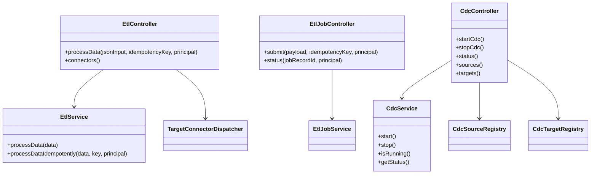

`EtlJobController` exists on protected develop but its entire controller is feature-gated and disabled by default.

## 2. Synchronous ETL Sequence — `implemented_on_develop`

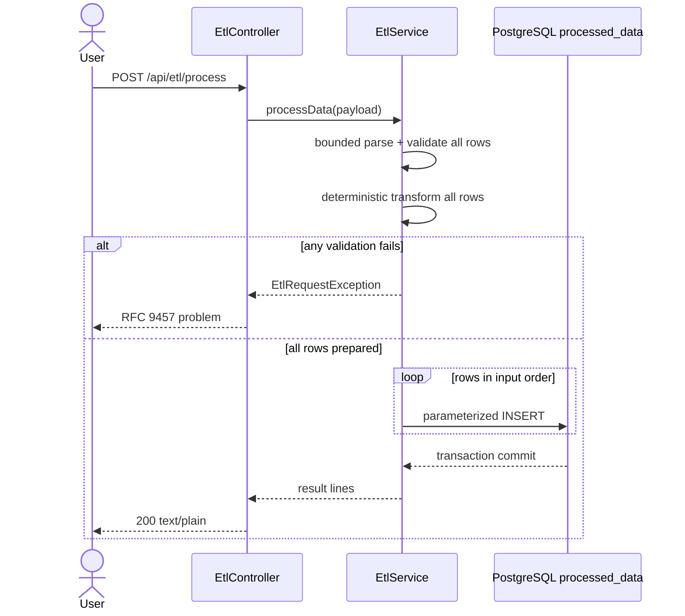

## 3. Idempotent Synchronous ETL Sequence — `implemented_on_develop`

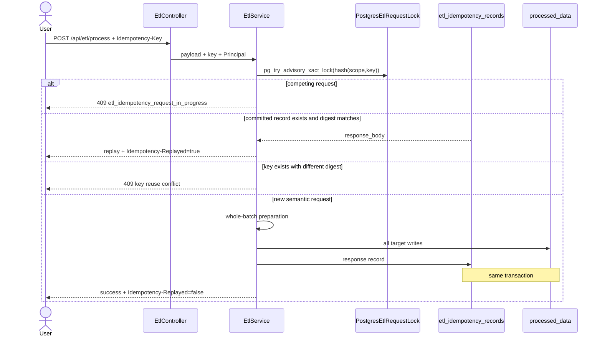

## 4. Durable Job Intake State — `implemented_on_develop`

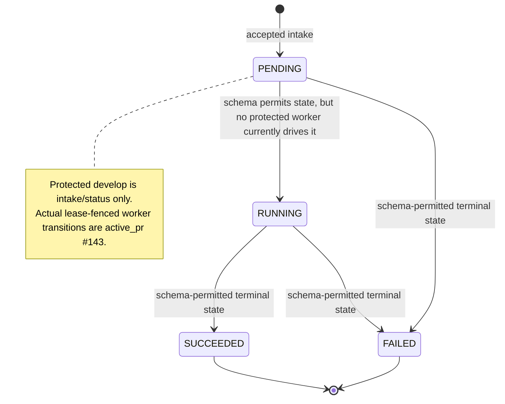

The diagram distinguishes a persisted allowed state machine from a shipped background execution engine. A schema-permitted transition is not proof that protected develop currently performs it.

## 5. Durable Job Active-PR Evolution — `active_pr`

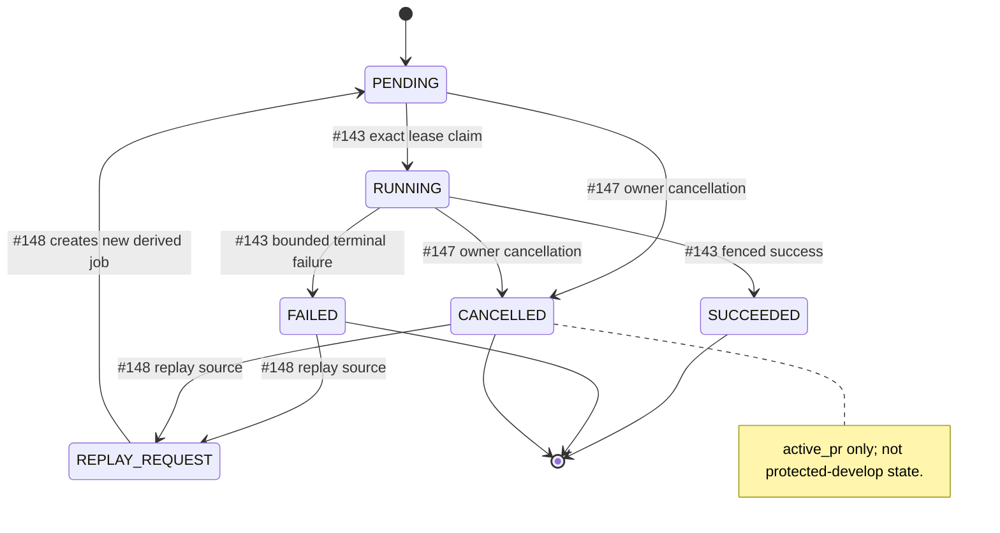

## 6. Durable Job Polling Sequence — `active_pr` stack overlay

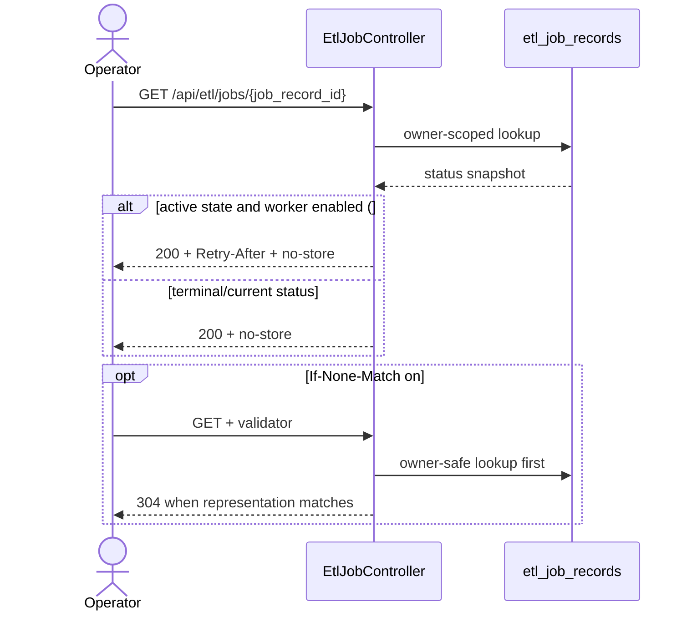

## 7. CDC Capture Sequence — `implemented_on_develop` + `known_gap`

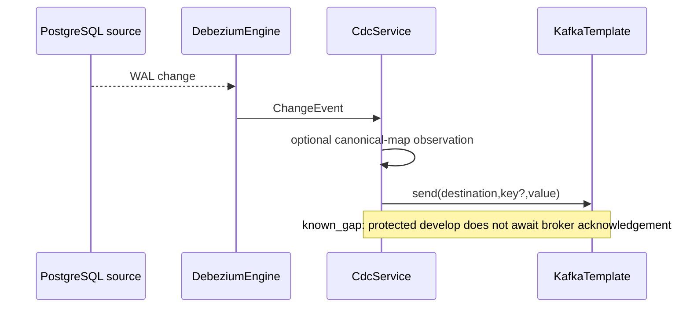

PR #139 is the `active_pr` path that waits for acknowledgement and retries/fails closed before Debezium progress.

## 8. CDC Stop State — `known_gap` and `planned`

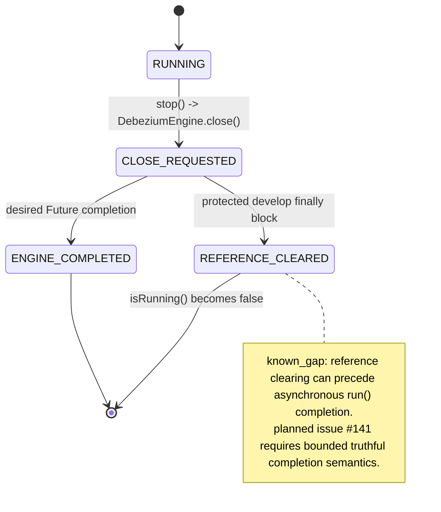

## 9. Gateway Trust State — `known_gap` / `active_pr`

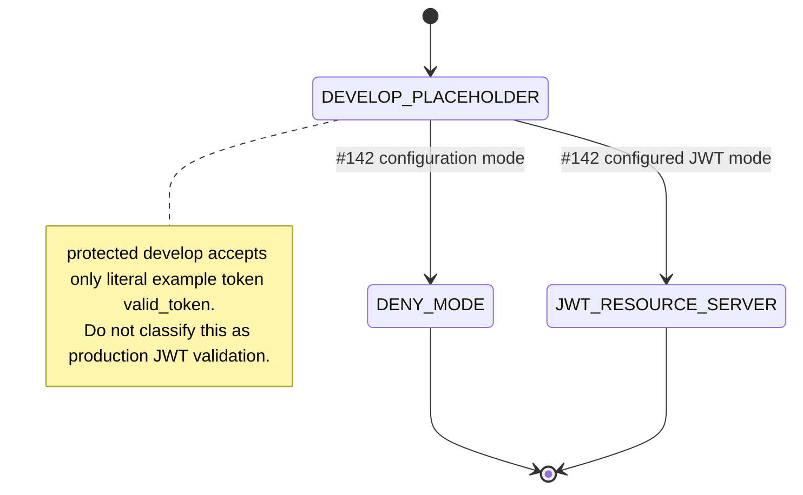

## 10. Deployment UML — `implemented_on_develop`

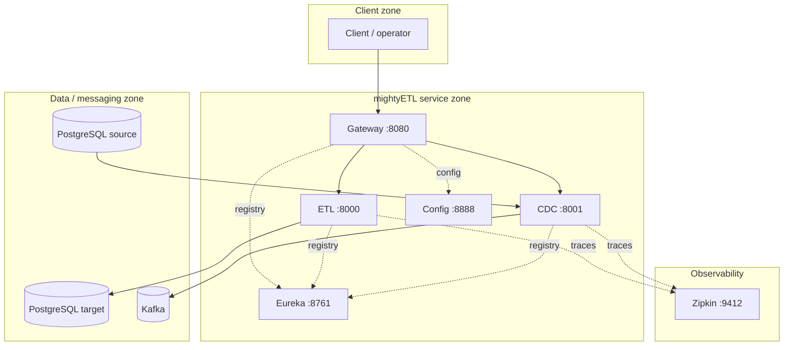

Standalone ETL and standalone CDC deployment remain supported architecture shapes; the full graph is not a mandatory all-or-nothing bundle.

## 11. Autonomous Development Authority — `active_pr` #121

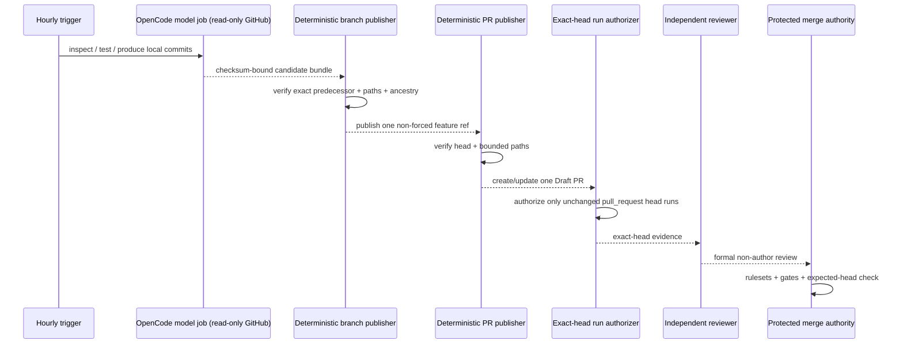

`NVIDIA_NIM_API_KEY` belongs only to model execution. Review and merge are not model capabilities.

## 12. Branch-Writer Compare-and-Swap — operating design

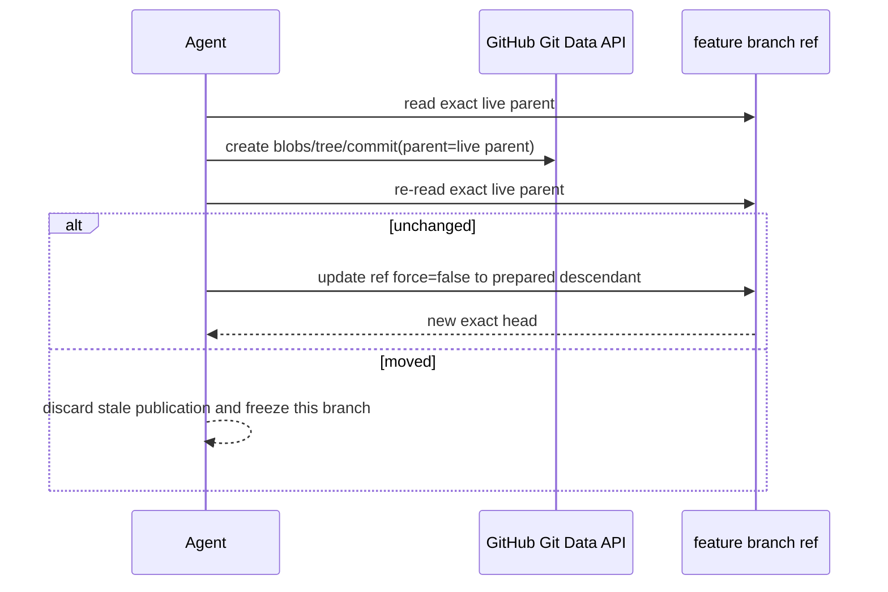

File-level Contents API blob checks remain useful for file identity, but they do not by themselves establish a branch-wide expected-parent compare-and-swap.
