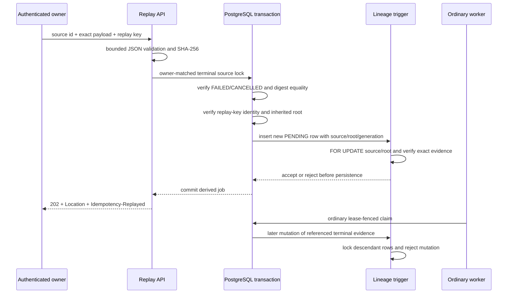

# ADR: Immutable durable-job replay lineage

- **Status:** Proposed while the replay pull request is stacked; Accepted only after direct-`develop` gates and merge
- **Date:** 2026-08-07
- **Decision owners:** mightyETL maintainers
- **Scope:** `etl-service` durable-job admission, persistence, operator API, and provenance

## Context

Durable jobs deliberately clear `request_payload` after success, failure, or cancellation. Operators nevertheless need a controlled way to retry failed or cancelled work without weakening source immutability, owner isolation, idempotency, lease fencing, or auditability.

Rewinding a terminal row to `PENDING` would erase the original terminal fact, mix attempt histories, invalidate conditional status validators, and make concurrent cancellation or success reasoning substantially harder. Retaining terminal payloads solely for replay would expand sensitive-data retention. Treating semantically equivalent JSON as the same work would also allow hidden payload changes under a replay label.

A structural schema with nullable source, root, and generation fields is not sufficient on its own. Composite foreign keys can prove same-owner existence, and check constraints can prove field completeness and bounds, but they cannot prove that a source is terminal, a root is the first row in the chain, a generation increments exactly once, or an existing replay has never been reparented. Those properties must remain true even for maintenance scripts, data imports, and future writers that do not execute the Java service.

Cross-row validity also creates a temporal requirement. Once a descendant commits a reference to terminal source or root evidence, a later direct writer must not change the referenced status, digest, payload state, attempt/failure state, cancellation evidence, or lifecycle timestamps. Otherwise the descendant's historical meaning can change after admission even though its lineage identifiers remain untouched. Child insertion and parent mutation therefore require one database-owned serialization boundary.

## Decision

Replay creates a **new** durable job. The terminal source remains unchanged.

The authenticated owner submits the source identifier, a replay-specific `Idempotency-Key`, and the complete bounded JSON text. Admission parses the payload through the ordinary durable-intake boundary and requires its SHA-256 digest to equal the immutable source `request_digest`. Only `FAILED` and `CANCELLED` sources are eligible. `SUCCEEDED` remains excluded because payload equality is not evidence that committed target effects may be repeated safely.

A derived row stores:

- `replay_source_job_record_id`: immediate source;
- `replay_root_job_record_id`: immutable first root of the replay chain;
- `replay_generation_count`: bounded positive generation.

Source and root references are composite owner-scoped foreign keys to `(job_record_id, principal_scope_hash)` and use `ON DELETE RESTRICT`. A root row has all three lineage fields null; a replay row has all three non-null. Generation cannot exceed the supported bound.

V7 also creates the PL/pgSQL function `validate_etl_job_replay_lineage()` and the row-level `etl_job_replay_lineage_guard_trigger`. The trigger is the database authority for exact source/root/generation continuity and referenced evidence immutability:

- replay rows are inserted only as `PENDING`, attempt zero, with a retained payload;
- immediate source and root belong to the same principal namespace as the new row;
- the immediate source is `FAILED` or `CANCELLED`;
- the root is terminal and has no lineage fields;
- generation one uses the same source and root;
- later generations retain that root and equal the immediate source generation plus one;
- lineage columns are immutable after insertion; and
- after any descendant references a row as immediate source or root, the terminal status, request evidence, attempt/failure state, cancellation evidence, and lifecycle timestamps are immutable.

The trigger uses PostgreSQL `FOR UPDATE` row locks for both source/root validation during child insertion and descendant lookup during a parent-evidence update. If a parent update commits first, a later child validates and binds the resulting evidence. If child insertion locks and references the parent first, a later conflicting parent update waits, observes the committed descendant, and fails closed. Ordinary lifecycle updates remain available until the row becomes referenced historical evidence.

The Java service independently verifies the inherited root is an actual first root before insertion. This is defense in depth; it does not replace the trigger. The new row enters the ordinary `PENDING` lifecycle and uses the existing worker, PostgreSQL claim, exact lease, success, failure, polling, cancellation, and ETag contracts.

## Replay identity

The stored replay identity uses a versioned replay-specific domain and the principal namespace. It is intentionally distinct from ordinary submission and cancellation domains. Raw principals and raw replay keys are not retained. The domain string is persistence compatibility behavior and cannot change without a migration or dual-read period.

NIST SP 800-185 motivates explicit domain separation, but the SHA-256 construction does not claim cSHAKE, KMAC, TupleHash, or ParallelHash conformance.

## HTTP behavior

- first committed replay: `202 Accepted`, `Location`, `Cache-Control: no-store`, `Idempotency-Replayed: false`;
- committed same-intent retry: same derived job, current lifecycle state, `Idempotency-Replayed: true`;
- absent or foreign source: indistinguishable `404 etl_job_not_found`;
- active source: stable `409` problem;
- succeeded source: stable `409` problem;
- byte-different payload: stable `422` problem;
- conflicting replay-key reuse: stable `422` problem;
- unresolved concurrent admission: stable retryable `409` problem;
- generation exhaustion: stable `409` problem.

All covered request failures use fixed RFC 9457 metadata and exclude exception messages, SQL, hashes, identifiers, payloads, and target details. A database-trigger rejection is an internal integrity incident; raw PL/pgSQL text must not enter the client response or ordinary telemetry.

## Connector boundary

The replay transaction can prove source ownership, payload fidelity, replay identity, exact lineage, referenced evidence immutability, and durable admission. It cannot prove that a remote warehouse, file system, API, or broker will suppress duplicate effects. Replay is enabled for a connector only when target effects participate in the mightyETL transaction or the connector provides independently tested idempotency or compensation.

## Alternatives rejected

### Rewind the terminal row

Rejected because it destroys terminal history, combines multiple execution episodes into one identity, complicates ETag semantics, and weakens race reasoning.

### Retain terminal payloads indefinitely

Rejected because replay does not justify expanding sensitive payload retention. The operator must recover the exact payload from an approved upstream or encrypted audit source.

### Accept semantic JSON equivalence

Rejected because normalization can obscure a changed request and creates a second canonicalization contract. Replay fidelity is byte-exact, matching durable submission identity.

### Permit succeeded-source replay

Rejected in the initial slice because a succeeded job may already have committed irreversible external effects.

### Rely only on application validation

Rejected because maintenance scripts, migrations, import processes, or future services can write directly to the table. Relational lineage must remain valid independently of one application binary.

### Use only foreign keys and check constraints

Rejected because those constraints cannot express exact generation succession, immutable cross-row root identity, or the transition from mutable terminal state to referenced immutable evidence. A row-level trigger is required for those cross-row and temporal invariants.

### Leave referenced evidence mutable

Rejected because a descendant would preserve the same source/root identifiers while the status, digest, terminal payload state, failure or cancellation evidence, or timestamps behind those identifiers changed. Audit and provenance exports would then describe a moving historical fact.

## Consequences

### Positive

- terminal sources remain immutable once replayed;
- each execution episode has a distinct opaque job identity;
- lineage supports incident analysis and future PROV-compatible export;
- ordinary worker and cancellation machinery is reused;
- payload retention does not increase;
- concurrent retries have one database-owned outcome;
- database maintenance and import paths cannot create discontinuous or reparented lineage;
- cross-owner, nonterminal, derived-root, skipped-generation, lineage-mutation, and referenced-evidence-mutation attempts fail closed.

### Costs

- operators must possess the exact original payload bytes;
- self-referencing lineage constrains retention and deletion order;
- every connector needs an explicit replay-safety classification;
- migrations and generation bounds require real PostgreSQL verification;
- the trigger adds same-transaction row locks and lookups to replay insertion and referenced-evidence updates;
- a terminal row cannot receive later maintenance edits after it becomes lineage evidence without a separately reviewed migration strategy;
- trigger and function lifecycle must be included in downgrade and disaster-recovery rehearsals.

## Verification

Acceptance requires exact-head tests for source immutability, owner isolation, exact payload matching, same-key replay, conflicting-key reuse, concurrent admission, lineage inheritance, generation exhaustion, ordinary worker behavior, cancellation compatibility, RFC 9457 responses, privacy exclusions, and zero-missed configured production coverage.

A direct-`develop` GitHub Actions gate applies every versioned migration to PostgreSQL 18, verifies replay and cancellation columns, verifies both lineage foreign keys use `ON DELETE RESTRICT`, verifies trigger and function presence, executes valid generation-one and generation-two inserts, rejects nonterminal sources, different generation-one roots, derived roots, skipped generations, cross-owner references, lineage mutation, referenced root-digest mutation, and referenced immediate-source failure-evidence mutation, protects source/root deletion, rehearses transactional rollback, and creates a non-empty schema-only dump. SAST, security, dependency, SBOM, review-thread, and non-author exact-head approval gates remain mandatory.

## References — APA 7th edition

Fielding, R., Nottingham, M., & Reschke, J. (2022). *HTTP semantics* (RFC 9110). RFC Editor. https://www.rfc-editor.org/rfc/rfc9110

National Institute of Standards and Technology. (2016). *SHA-3 derived functions: cSHAKE, KMAC, TupleHash, and ParallelHash* (NIST Special Publication 800-185). U.S. Department of Commerce. https://doi.org/10.6028/NIST.SP.800-185

Nottingham, M., Wilde, E., & Dalal, S. (2023). *Problem details for HTTP APIs* (RFC 9457). RFC Editor. https://www.rfc-editor.org/rfc/rfc9457

PostgreSQL Global Development Group. (2026). *PostgreSQL 18 documentation: Constraints*. https://www.postgresql.org/docs/18/ddl-constraints.html

PostgreSQL Global Development Group. (2026). *PostgreSQL 18 documentation: CREATE TRIGGER*. https://www.postgresql.org/docs/18/sql-createtrigger.html

PostgreSQL Global Development Group. (2026). *PostgreSQL 18 documentation: INSERT*. https://www.postgresql.org/docs/18/sql-insert.html

PostgreSQL Global Development Group. (2026). *PostgreSQL 18 documentation: PL/pgSQL trigger functions*. https://www.postgresql.org/docs/18/plpgsql-trigger.html

World Wide Web Consortium. (2013). *PROV-O: The PROV ontology*. https://www.w3.org/TR/prov-o/
