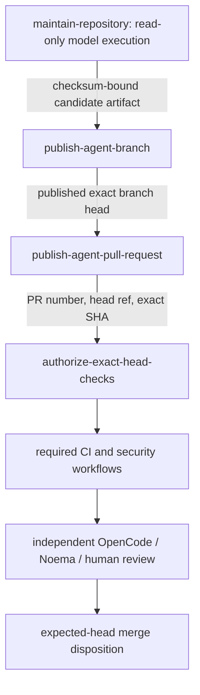

# GitHub-token publication and exact-head authorization evidence

Reviewed on: **2026-08-09**

## Decision

The hourly development loop uses the repository-scoped `GITHUB_TOKEN`, but no model-executing
process receives remote repository write authority. Source analysis and local candidate creation,
branch publication, pull-request publication, workflow-run authorization, independent review, and
merge are separate authorities.

The deployed contract is:

```text
model execution and local commit
        ≠
deterministic branch publication
        ≠
draft pull-request publication
        ≠
workflow-run authorization
        ≠
independent review and merge
```

This separation addresses three concrete failure modes found during exact-head review:

1. `pull-requests: write` on a model job could allow a model process to call pull-request lifecycle
   endpoints even when its prompt prohibited that behavior.
2. model-scoped `contents: write` unnecessarily coupled repository execution to remote branch
   mutation.
3. authorizing workflow runs by `head_sha` alone could authorize a run associated with another pull
   request that referenced the same commit.

The current design therefore keeps the OpenCode job read-only and transfers one checksum-bound local
candidate through deterministic jobs with narrowly separated write permissions.

## Primary-source finding

OpenCode 1.18.13 exposes two relevant execution paths.

- `opencode github run` includes GitHub lifecycle behavior and can participate in pull-request
  publication after model execution.
- `opencode run` is the plain non-interactive model runner and does not itself require pull-request
  publication authority.

mightyETL uses `opencode run --model ... --auto` with repository-read-only GitHub authority. The
model may inspect, edit, test, and commit one bounded candidate in the checked-out local Git
repository, but it cannot publish that commit to GitHub. Deterministic non-model jobs validate and
publish the exact candidate separately.

## Authority topology



### Model job

`maintain-repository` is the only job that checks out source or runs OpenCode. It has read-only GitHub authority:

```text
actions: read
checks: read
contents: read
issues: read
pull-requests: read
security-events: read
statuses: read
```

The model can inspect GitHub state and can create commits only in the runner-local checkout. It has
no GitHub token permission that can update a branch, issue, pull request, workflow run, status, or
security result. It contains no `git push`. The prompt prohibition on remote pull-request mutation,
protected-branch pushes, approval, merge, and release remains defense in depth rather than the
primary authorization boundary.

### Deterministic branch publisher

`publish-agent-branch` is the sole `contents: write` holder. It has:

```text
actions: read
contents: write
```

It never checks out repository source through `actions/checkout`, never receives `NVIDIA_API_KEY`,
and never runs OpenCode. It downloads only the candidate artifact emitted by the model job and
requires the artifact metadata and SHA-256 digest to match the exact upstream job output.

Before a branch write, it verifies:

- the protected `develop` head is unchanged from the model-job snapshot;
- for an existing pull request, the exact live branch and captured predecessor SHA are unchanged;
- for a new branch, the strict `automation/opencode-YYYYMMDDTHHMMSSZ-short-slug` namespace does not
  already exist remotely;
- the imported bundle contains the expected exact candidate head;
- the candidate is a non-destructive descendant of the exact predecessor;
- the candidate has between 1 and 50 commits and contains no merge commit;
- at most 50 paths changed;
- no `.github/**` or `CODEOWNERS` path changed; and
- `git diff --check` succeeds.

Only then does the job perform one non-forced branch push. It immediately reads the remote branch
back and requires the live SHA to equal the exact candidate head. A moved predecessor, changed
protected head, invalid artifact, unexpected path, destructive ancestry, ambiguous remote branch,
or mismatched post-push head fails closed.

### Deterministic pull-request publisher

`publish-agent-pull-request` is the sole `pull-requests: write` holder. It has:

```text
contents: read
pull-requests: write
```

It never checks out or executes repository source and never receives `NVIDIA_API_KEY`. It accepts
only metadata from the successful deterministic branch publisher, rereads the live branch or
existing pull request, verifies the exact expected head and bounded path policy, and creates at most
one draft pull request when a new validated branch has no existing pull request. It contains no
review-approval or merge endpoint.

### Exact-head run authorizer

`authorize-exact-head-checks` is the sole `actions: write` holder. It has:

```text
actions: write
contents: read
pull-requests: read
```

It never checks out source and never receives the model credential. Before authorizing a waiting
run, it requires:

```text
run.event == pull_request
run.head_sha == expected_head
any(run.pull_requests; number == expected_pull_request_number)
live pull request head == expected_head
```

The `pull_requests` association is mandatory. A commit SHA is not a unique pull-request identity:
more than one pull request can reference the same commit. The job may authorize only
`action_required` or `waiting` workflow runs and contains no pull-request approval or merge
operation.

The model-executing job receives none of those write permissions. No deterministic writer receives
the NVIDIA model credential, and neither the model job nor any deterministic scheduler job can
manufacture the independent non-author review required before merge.

## Complete workflow materialization

GitHub can materialize pull-request workflows asynchronously. The authorizer repeats bounded
discovery and authorizes newly visible `action_required` or `waiting` runs on every pass. It
succeeds only after this complete workflow-name set is associated with the exact pull request and
exact SHA:

```text
CI
Dependency Review
SBOM (CycloneDX)
SAST Semgrep
Security Scan
```

Name presence proves only that a run was created. Every required run must still complete
successfully on acceptable exact-head evidence before merge. Queued, waiting, action-required,
skipped-required, cancelled, stale-head, synthetic-merge-only, absent, neutral-required, or failed
evidence remains non-passing.

## Time-of-check/time-of-use controls

The loop validates state at several boundaries:

1. snapshot `develop`, open pull-request heads, and prior automation branches before model execution;
2. require `develop`, the open pull-request set, and automation-branch state to remain unchanged
   after the model exits;
3. select at most one exact local candidate and bind its predecessor, branch, and candidate SHA into
   metadata;
4. create a Git bundle plus SHA-256 digest and transfer only that bounded artifact to the branch
   publisher;
5. re-read protected `develop` and the exact predecessor immediately before branch publication;
6. verify bundle integrity, ancestry, commit count, merge-free history, path count, policy-path
   exclusion, and `git diff --check` before one non-forced push;
7. read the published branch back and require its live SHA to equal the candidate SHA;
8. re-read the branch or pull request before draft pull-request publication;
9. re-read the pull request before workflow-run discovery;
10. re-read the exact head on every discovery pass; and
11. re-read it once more before declaring workflow-run authorization complete.

A moved head or base, multiple candidate, invalid namespace, changed policy path, artifact mismatch,
absent required workflow, or GitHub authorization rejection fails closed.

## Test-first evidence

`HourlyOpenCodeMaintenanceWorkflowTest` proves the executable authority boundary, including:

- plain `opencode run`, not the GitHub lifecycle handler;
- `contents: read`, `issues: read`, and `pull-requests: read` on the model job;
- no `contents: write`, `pull-requests: write`, or `actions: write` on the model job;
- exactly one isolated branch publisher with `contents: write` and no model credential;
- exactly one non-checkout pull-request publisher with `pull-requests: write`;
- exactly one non-checkout authorizer with `actions: write`;
- no NVIDIA credential in any privileged deterministic writer;
- one strict publication candidate;
- draft-only deterministic pull-request publication;
- `.github/**` and `CODEOWNERS` exclusion;
- exact pull-request association for every workflow run;
- complete required-workflow materialization; and
- continued absence of review and merge endpoints.

During the 2026-08-09 acquisition-evidence audit, this doctoring file was found to describe an older
authority topology in which the model job still held `contents: write` and pushed a branch itself.
That prose contradicted the executable workflow even though the executable least-privilege boundary
was already narrower.

A fail-first contract was therefore added before changing this document. Exact-head commit
`b1afefd9a8264c4cf7f5c409f853abebfe70dc17` was checked out by CI run `31266495903`; macOS job
`93125370929` ran 317 tests and failed exactly the two new
`HourlyOpenCodeAuthorityDocumentationTest` methods that require current model-read-only and
separated-writer doctoring. The existing tests passed up to that intentional documentation
contract. Checks from that RED head do not transfer to a later head.

The authoritative acceptance condition after this correction is a fresh exact-head CI run in which
those two tests and the complete project suite pass, plus the ordinary dependency, SBOM, SAST,
security, status, review-thread, and independent-approval gates for that unchanged head.

## Residual risks, remediation feasibility, and controls

### `contents: write` Scorecard finding

GitHub Advanced Security currently reports the isolated `publish-agent-branch` job's job-scoped
`contents: write` permission. This is a real sensitive capability and remains visible rather than
being mislabeled as eliminated.

Root-cause options were evaluated against the deployed architecture:

1. **Remove `contents: write`.** Rejected for the current autonomous-development design because the
   validated local commit would have no GitHub branch-persistence authority; this removes the
   required function rather than reducing its write surface while preserving behavior.
2. **Move branch publication back into the model job.** Rejected because it expands the untrusted
   model-execution authority and reverses the existing separation of duties.
3. **Introduce a PAT, new secret, or GitHub App solely to avoid the Scorecard signal.** Rejected
   unless a separately reviewed credential actually exists and proves narrower endpoint scope,
   lifetime, installation scope, auditability, and branch-protection behavior. No credential is
   invented merely because a scanner dislikes a required permission.
4. **Keep one deterministic `contents: write` branch publisher with exact artifact, ancestry,
   live-ref, path, commit-count, and post-write SHA validation.** Executable now and the narrowest
   currently proven design that retains autonomous branch publication.

The unresolved Scorecard thread therefore remains open while the permission exists. A green
aggregate Security Scan is not treated as literal-head proof if its relevant scanner checked a
synthetic merge. The separately leased organization scanner repair must integrate before
literal-head scanner/SARIF evidence can support final disposition. Documentation alone does not
resolve the scanner finding.

### Other residual risks

- The deterministic pull-request publisher necessarily has coarse `pull-requests: write`
  permission. It has no checkout, model input, NVIDIA credential, or executable repository source,
  and its script exposes only bounded draft publication or metadata validation.
- `actions: write` can authorize workflow execution. It is isolated in a non-checkout job, exact
  pull-request association is mandatory, and workflow-path changes are refused from autonomous
  candidate publication.
- Workflow-run authorization is an Actions control, not a successful check or pull-request
  approval.
- A workflow or `CODEOWNERS` change always requires explicit human authorization under this
  scheduler contract.
- Independent exact-head approval remains mandatory after every new commit; checks, statuses,
  comments, reactions, author reviews, and textual acknowledgements do not substitute for it.

## Failure behavior

Any mismatch between the documented authority topology and the executable workflow is a failed
security-evidence contract, not a documentation-only cosmetic issue. The fix is to reconcile the
authoritative evidence to the narrower executable behavior or deliberately redesign the workflow
under a new fail-first contract. Do not make the executable workflow more permissive merely to make
an old document true.

If GitHub changes `GITHUB_TOKEN` recursion, branch-update, review-request, or workflow-run approval
semantics, disable the affected autonomous path until the exact authority boundary is revalidated.
Do not restore pull-request or content write authority to the model job as a shortcut.

## Rollback

Rollback of this evidence correction is permitted only together with a reviewed replacement that
still describes the exact deployed authority topology. Do not roll back by moving branch
publication into the model job, by restoring model-scoped `contents: write` or `pull-requests:
write`, by accepting SHA-only workflow-run authorization, or by weakening exact-head, review,
branch-protection, and policy-path gates.

A GitHub App or endpoint proxy may replace the deterministic branch publisher only after its
endpoint allowlist, actor identity, installation scope, token lifetime, audit log, protected-branch
behavior, and exact-head acceptance path are independently tested and documented.

## References — APA 7th

Anomaly. (2026). *GitHub handler (Version 1.18.13)* [Source code]. GitHub.
https://github.com/anomalyco/opencode/blob/v1.18.13/packages/opencode/src/cli/cmd/github.handler.ts

Anomaly. (2026). *Run command (Version 1.18.13)* [Source code]. GitHub.
https://github.com/anomalyco/opencode/blob/v1.18.13/packages/opencode/src/cli/cmd/run.ts

GitHub, Inc. (2026). *GITHUB_TOKEN*. GitHub Docs.
https://docs.github.com/en/actions/concepts/security/github_token

GitHub, Inc. (2026). *REST API endpoints for workflow runs*. GitHub Docs.
https://docs.github.com/en/rest/actions/workflow-runs

GitHub, Inc. (2026). *Security hardening for GitHub Actions*. GitHub Docs.
https://docs.github.com/en/actions/security-for-github-actions/security-guides/security-hardening-for-github-actions
