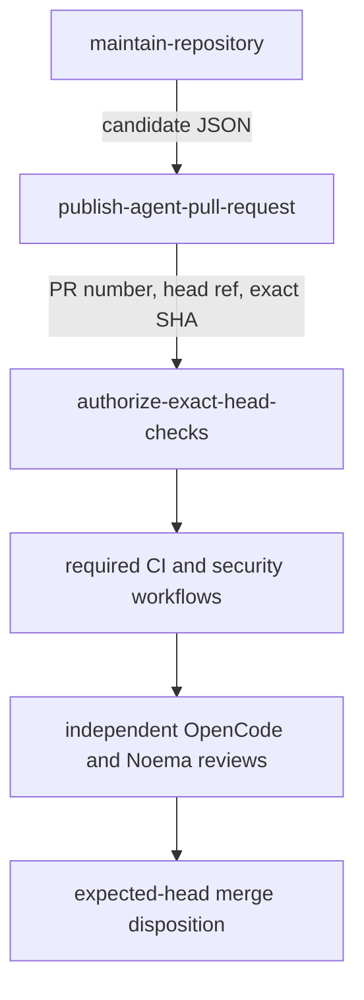

# GitHub-token publication and exact-head authorization evidence

## Decision

The hourly development loop uses the repository-scoped `GITHUB_TOKEN`, but it does not expose the same GitHub authority to the model, the pull-request publisher, and the workflow-run authorizer.

The deployed contract is:

```text
model execution and branch push
        ≠
draft pull-request publication
        ≠
workflow-run authorization
        ≠
independent review and merge
```

This separation addresses two concrete failure modes found during exact-head review:

1. `pull-requests: write` on the OpenCode job allowed the model process to call review and merge endpoints even when the prompt prohibited it.
2. authorizing workflow runs by `head_sha` alone could authorize a run associated with another pull request that referenced the same commit.

## Primary-source finding

OpenCode 1.18.13 exposes two relevant execution paths.

- `opencode github run` includes GitHub lifecycle behavior and can call the pull-request creation endpoint after committing and pushing scheduled work.
- `opencode run` is the plain non-interactive model runner and does not itself own GitHub pull-request publication.

mightyETL therefore uses `opencode run --model ... --auto` under a read-only pull-request token. Deterministic jobs validate and publish the resulting branch separately.

## Authority topology



### Model job

`maintain-repository` is the only job that checks out source or runs OpenCode. It has:

```text
actions: read
checks: read
contents: write
issues: write
pull-requests: read
security-events: read
statuses: read
```

The model can inspect pull requests and push one branch. It cannot create, update, approve, close, or merge a pull request through the token. The prompt prohibition remains defense in depth rather than the primary authorization boundary.

### Deterministic publisher

`publish-agent-pull-request` has:

```text
contents: read
pull-requests: write
```

It never checks out or executes repository code and never receives `NVIDIA_API_KEY`. It accepts only one structured candidate emitted by the model job. A new branch must:

- match `automation/opencode-YYYYMMDDTHHMMSSZ-short-slug`;
- retain the captured exact SHA;
- be ahead of `develop`;
- change at most 50 files;
- avoid `.github/**` and all `CODEOWNERS` paths.

The publisher creates a draft with a fixed JSON payload. It contains no pull-request review or merge endpoint.

### Exact-head run authorizer

`authorize-exact-head-checks` has:

```text
actions: write
contents: read
pull-requests: read
```

It never checks out source and never receives the model credential. Before authorizing a run, it requires:

```text
run.event == pull_request
run.head_sha == expected_head
any(run.pull_requests; number == expected_pull_request_number)
live pull request head == expected_head
```

The `pull_requests` association is mandatory. A commit SHA is not a unique pull-request identity: more than one pull request can reference the same commit.

## Complete workflow materialization

GitHub can materialize pull-request workflows asynchronously. The authorizer repeats bounded discovery and authorizes newly visible `action_required` or `waiting` runs on every pass. It succeeds only after this complete workflow-name set is associated with the exact pull request and exact SHA:

```text
CI
Dependency Review
SBOM (CycloneDX)
SAST Semgrep
Security Scan
```

Name presence proves only that a run was created. Every run must still complete successfully before merge.

## Time-of-check/time-of-use controls

The loop validates state at several points:

1. snapshot `develop`, open pull-request heads, and prior automation branches before model execution;
2. require `develop` to remain unchanged after the model exits;
3. select at most one changed existing pull request or strict automation branch;
4. re-read the branch or pull request before draft publication;
5. re-read the pull request before workflow-run discovery;
6. re-read the exact head on every discovery pass;
7. re-read it once more before declaring authorization complete.

A moved head, multiple candidate, invalid namespace, policy-file change, absent required workflow, or GitHub authorization rejection fails closed.

## Test-first evidence

`HourlyOpenCodeMaintenanceWorkflowTest` was changed before production to require:

- plain `opencode run`, not the GitHub lifecycle handler;
- `pull-requests: read` on the model job;
- exactly one non-checkout publisher with `pull-requests: write`;
- exactly one non-checkout authorizer with `actions: write`;
- no NVIDIA credential in either privileged deterministic job;
- one strict publication candidate;
- draft-only deterministic publication;
- `.github/**` and `CODEOWNERS` exclusion;
- exact pull-request association for every workflow run;
- complete required-workflow materialization;
- continued absence of review and merge endpoints.

The initial test commit intentionally made the existing workflow contract fail. Production was then changed to satisfy the new authority and association requirements.

## Residual risks and controls

- `contents: write` remains necessary for a branch push. Protected-branch rules remain authoritative for `develop` and `main`.
- The deterministic publisher necessarily has coarse pull-request write permission. It has no checkout, model input, or executable repository source and its script exposes only draft creation or metadata validation.
- Workflow-run approval is an Actions control, not a successful check or pull-request approval.
- A workflow or `CODEOWNERS` change always requires explicit human authorization.
- Independent exact-head approval remains mandatory after every new commit.

## Rollback

Disable the hourly workflow if the platform's `GITHUB_TOKEN` recursion or workflow-run approval model changes. Do not restore pull-request write authority to the model job and do not revert to SHA-only run authorization.

A GitHub App or endpoint proxy may replace the publisher only after its endpoint allowlist, actor identity, installation scope, token lifetime, audit log, and exact-head behavior are independently tested and documented.

## References — APA 7th

Anomaly. (2026). *GitHub handler (Version 1.18.13)* [Source code]. GitHub. https://github.com/anomalyco/opencode/blob/v1.18.13/packages/opencode/src/cli/cmd/github.handler.ts

Anomaly. (2026). *Run command (Version 1.18.13)* [Source code]. GitHub. https://github.com/anomalyco/opencode/blob/v1.18.13/packages/opencode/src/cli/cmd/run.ts

GitHub, Inc. (2026). *GITHUB_TOKEN*. GitHub Docs. https://docs.github.com/en/actions/concepts/security/github_token

GitHub, Inc. (2026). *REST API endpoints for workflow runs*. GitHub Docs. https://docs.github.com/en/rest/actions/workflow-runs

GitHub, Inc. (2026). *Security hardening for GitHub Actions*. GitHub Docs. https://docs.github.com/en/actions/security-for-github-actions/security-guides/security-hardening-for-github-actions
