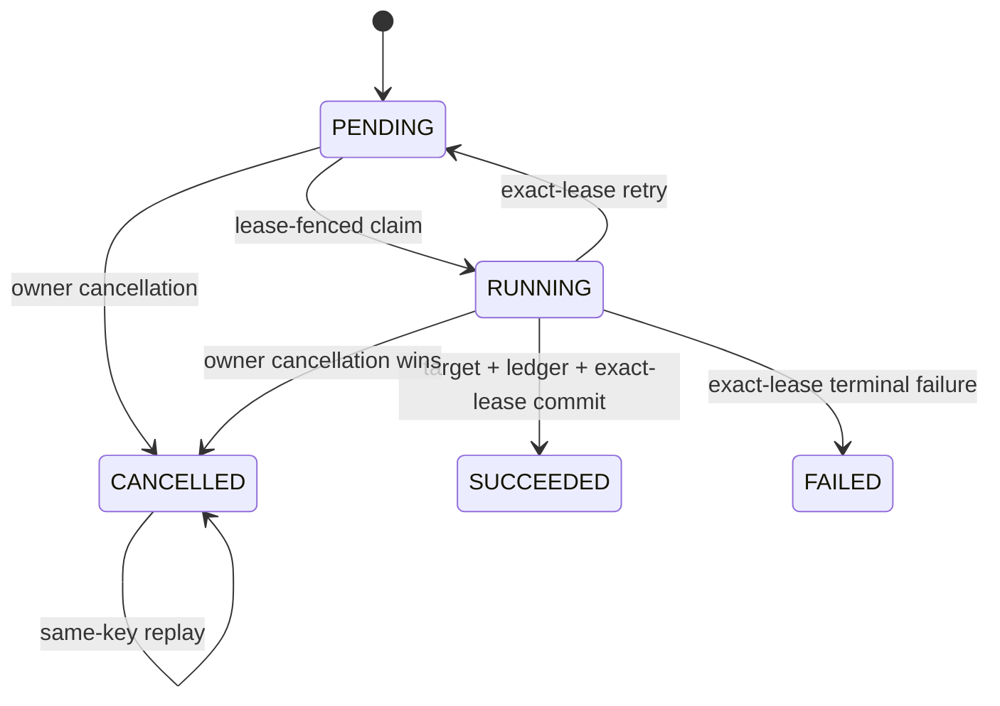
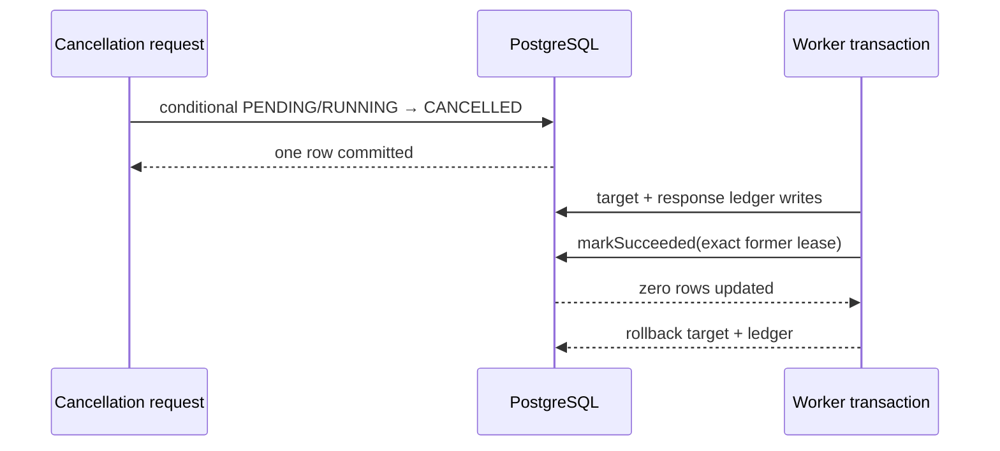
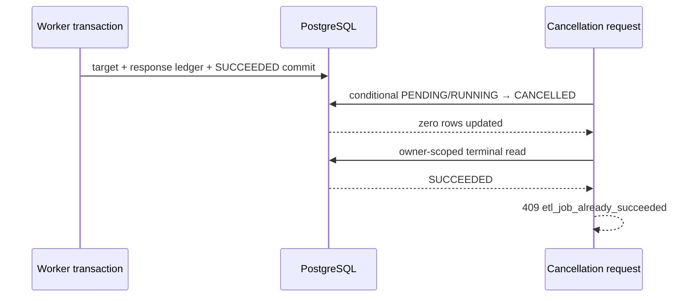

# Durable ETL job cancellation

## Purpose

Authenticated operators can stop a durable ETL job that is still `PENDING` or `RUNNING` through:

```http
POST /api/etl/jobs/{job_record_id}/cancellation HTTP/1.1
Authorization: Basic <credentials>
Idempotency-Key: "70dc8b50-e8b2-4e1a-8c5f-d84814708a77"
```

A successful response proves that the database transition committed or that the same principal,
job identifier, and normalized cancellation key had already committed. HTTP request acceptance by
itself is never treated as cancellation success.

The first slice establishes a database-owned terminal state. It does not forcibly terminate a Java
thread, interrupt arbitrary connector computation, or compensate a non-transactional external
warehouse.

## HTTP contract

A first cancellation returns:

```http
HTTP/1.1 200 OK
Cache-Control: no-store
Idempotency-Replayed: false
ETag: W/"<sha256>"
Content-Type: application/json

{
  "jobRecordId": "cf4f083f-8c90-4f34-a8b6-b53761de44ef",
  "jobStatus": "CANCELLED",
  "attemptCount": 1,
  "createdAt": "2026-08-05T01:00:00Z",
  "updatedAt": "2026-08-06T03:00:00Z"
}
```

Repeating the same semantic key returns `Idempotency-Replayed: true` and the same terminal resource.
A different key for the already-cancelled job returns
`422 etl_job_cancellation_key_reused`. Malformed, missing, and foreign-owned identifiers share the
same `404 etl_job_not_found` response. Cancellation after committed success or failure returns
`409 etl_job_already_succeeded` or `409 etl_job_already_failed` under RFC 9110 current-state conflict
semantics.

Every success and covered failure uses `Cache-Control: no-store`. The response exposes no payload,
principal, cancellation key, key hash, lease identifier, SQL, exception message, or target identity.

## State machine



`SUCCEEDED`, `FAILED`, and `CANCELLED` are terminal. Cancelled status never receives `Retry-After`.
Its state and `updatedAt` value also invalidate every earlier weak status `ETag`.

## Database authority

`EtlJobService.cancelOwned` first validates the job identifier, cancellation key, and authenticated
principal, then performs one conditional update inside a Spring transaction:

```sql
UPDATE etl_job_records
SET job_status = 'CANCELLED',
    request_payload = NULL,
    failure_code = NULL,
    lease_claim_id = NULL,
    lease_owner_id = NULL,
    lease_expires_at = NULL,
    cancellation_key_hash = ?,
    cancellation_code = 'etl_job_cancelled_by_owner',
    job_cancelled_at = CURRENT_TIMESTAMP,
    updated_at = CURRENT_TIMESTAMP
WHERE job_record_id = ?
  AND principal_scope_hash = ?
  AND job_status IN ('PENDING', 'RUNNING');
```

The update count is the authority. A follow-up owner-scoped read classifies a zero-row result as:

- identical `CANCELLED` replay;
- conflicting cancellation key;
- already `SUCCEEDED`;
- already `FAILED`;
- an active row whose concurrent transition is still unresolved; or
- owner-safe not found.

The raw principal and key are never stored. Their lowercase SHA-256 values are used only for owner
selection and replay identity.

## Cancellation-versus-success race

### Cancellation commits first



The cancelled row has no lease fields. The former worker's exact-live-lease success predicate updates
zero rows and raises `StaleEtlJobLeaseException`; Spring rolls back its target and
`etl_idempotency_records` writes.

### Success commits first



Exactly one terminal state wins. The endpoint never rewrites `SUCCEEDED` or `FAILED` as cancelled.

## Migration

`V6__add_etl_job_cancellation.sql` adds these descriptive multi-word `snake_case` columns:

- `cancellation_key_hash`;
- `cancellation_code`;
- `job_cancelled_at`.

It replaces lifecycle checks so that:

- `PENDING` and `RUNNING` retain a payload;
- `SUCCEEDED`, `FAILED`, and `CANCELLED` have no payload;
- only `RUNNING` has lease fields;
- only `FAILED` has `failure_code`;
- only `CANCELLED` has the three cancellation fields;
- hash and code values satisfy bounded fixed formats.

The migration is transactional. Before production rollout, rehearse it against a representative
PostgreSQL 18 copy and confirm that no out-of-contract legacy row violates the replacement checks.
Monitor migration duration, lock wait, transaction age, replication lag, and application error rates.

## Rollout

1. Verify PR exact-head CI on Ubuntu, macOS, and Windows with no skipped project test.
2. Verify dependency review, CycloneDX SBOM, SAST, security scan, unresolved-thread, and independent
   current-head approval gates.
3. Apply Flyway V6 before serving the new route.
4. Keep `mightyetl.etl.jobs.intake-enabled=false` during a conservative schema-only rollout if the
   deployment process cannot guarantee application/schema ordering.
5. Enable the new application build and perform an owner-isolation smoke test with a disposable job.
6. Verify a first cancellation, same-key replay, different-key rejection, and a status read.
7. Confirm cancelled rows have null payload and lease fields and a fixed cancellation code.
8. Observe worker `stale` outcomes during deliberate running-job cancellation; this is expected
   fencing evidence, not a duplicate-execution success.

## Monitoring

The cancellation endpoint uses fixed observation name `etl.jobs.cancel`. Do not attach job IDs,
principals, raw keys, key hashes, lease IDs, payloads, SQL, exception classes, messages, target
identities, or queue depth as metric labels.

Monitor at least:

- request rate and HTTP outcome count;
- cancellation latency;
- database update latency and lock waits;
- worker `stale` outcome changes;
- cancellation replay and key-conflict rate;
- cancelled rows retaining payload or lease fields, which must remain zero;
- target or ledger effects associated with cancellation-first tests, which must remain zero.

## Incident response

### Cancellation returns `etl_job_cancellation_in_progress`

Re-read the owner-scoped status. A concurrent claim, retry, success, failure, or cancellation may have
won after the request's conditional update. Do not retry with a new idempotency key until the current
terminal or active state is understood.

### Worker reports stale after cancellation

This is the expected safety outcome when cancellation invalidates a running lease. Confirm the target
and response-ledger transaction rolled back. Repeated stale outcomes without operator cancellations
may indicate lease expiry, another worker, or database clock/latency problems.

### Cancelled row retains payload or lease data

Treat this as a high-severity lifecycle integrity incident. Stop intake and workers, preserve the row
and transaction evidence, verify the deployed schema constraints and application SHA, and do not
manually rewrite the state until the root cause and rollback effects are understood.

## Rollback

Stop serving the cancellation endpoint before application rollback. Older binaries do not understand
`CANCELLED`, so they must not read or process cancelled rows as if only four states existed.

Do not drop V6 columns or restore the old status constraint while any cancelled row remains. A
controlled database rollback must first archive cancelled resources and their audit evidence under an
approved retention policy. Never silently map `CANCELLED` to `FAILED` or `SUCCEEDED`.

After cancelled rows are safely removed and every older binary is deployed, an explicit reviewed
migration may drop the V6 constraints and columns and restore the four-state lifecycle. Do not edit or
repair the applied V6 migration file in place.

## Connector limitation

The cancellation-first rollback guarantee is valid for target and response-ledger writes that join the
same transaction and database as the job state. A remote warehouse, file upload, external API, or
message broker that cannot participate in that transaction requires connector-native cancellation,
idempotency, or compensation before the same guarantee can be advertised. This release deliberately
does not claim arbitrary external side-effect reversal.

## References — APA 7th

Fielding, R., Nottingham, M., & Reschke, J. (2022). *HTTP semantics* (RFC 9110). RFC Editor.
https://www.rfc-editor.org/rfc/rfc9110

Nottingham, M., Wilde, E., & Dalal, S. (2023). *Problem details for HTTP APIs* (RFC 9457). RFC Editor.
https://www.rfc-editor.org/rfc/rfc9457

PostgreSQL Global Development Group. (2026). *PostgreSQL 18 documentation: Data consistency checks at
the application level*. https://www.postgresql.org/docs/18/applevel-consistency.html

PostgreSQL Global Development Group. (2026). *PostgreSQL 18 documentation: UPDATE*.
https://www.postgresql.org/docs/18/sql-update.html
