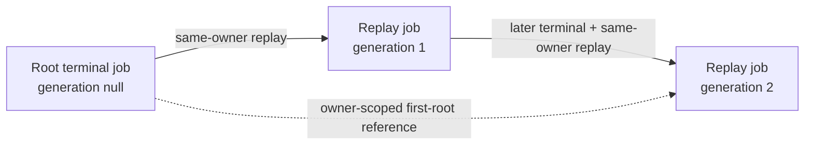

# Durable ETL job replay

## Purpose

`POST /api/etl/jobs/{source_job_record_id}/replays` creates a new ordinary durable job from an
immutable failed or cancelled source. The operator must resupply the complete bounded JSON payload.
mightyETL validates that payload through the ordinary intake contract and requires its SHA-256 digest
to equal the terminal source `request_digest` before any new row is inserted.

Replay never changes a terminal source back to `PENDING`.

## HTTP contract

```http
POST /api/etl/jobs/cf4f083f-8c90-4f34-a8b6-b53761de44ef/replays HTTP/1.1
Authorization: Basic <credentials>
Idempotency-Key: "1e05bdca-447c-4ad3-882c-e33963ce517c"
Content-Type: application/json

[{"id":"record_alpha"}]
```

A first replay returns:

```http
HTTP/1.1 202 Accepted
Location: /api/etl/jobs/86e4d474-dabf-4d6a-9de4-4e8230589363
Cache-Control: no-store
Idempotency-Replayed: false
Content-Type: application/json
```

The representation is the existing accepted-job model. A later identical retry returns the same new
job and its current lifecycle state with `Idempotency-Replayed: true`. `202 Accepted` is
noncommittal: it proves durable admission of the new job, not completion of its ETL effects.

Malformed, missing, and foreign-owned source identifiers share `404 etl_job_not_found`. Active
sources return `409 etl_job_replay_source_active`; succeeded sources return
`409 etl_job_replay_source_succeeded`. A mismatching payload returns
`422 etl_job_replay_payload_mismatch`. Reusing one replay key with another source or payload returns
`422 etl_job_replay_key_reused`.

## Source immutability

The source row is selected under the authenticated principal and a row lock, but never updated. Its
status, failure or cancellation evidence, timestamps, digest, terminal null payload, and lineage
remain unchanged. Only `FAILED` and `CANCELLED` are eligible.

The client must resupply exact JSON text because terminal jobs deliberately clear `request_payload`.
Whitespace or field-order changes produce another digest even when a parser would consider the JSON
semantically equivalent. This byte-exact rule mirrors durable submission and prevents operators from
silently changing the work while claiming to replay it.

## Replay identity and concurrency

The normalized key is stored only through this versioned principal-scoped identity:

```text
SHA-256(
  "mightyetl:durable-job-replay:v1:"
  || principal_scope_hash
  || ":"
  || normalized_replay_key
)
```

The value occupies the replay-created row's existing `submission_key_hash` field. It cannot collide
with ordinary raw-key submission identities unless SHA-256 itself collides. The exact domain string
is persisted compatibility behavior and cannot change without a migration.

A PostgreSQL transaction-level try-lock serializes one replay key within a principal namespace. A
concurrent request that cannot acquire it receives `409 etl_job_replay_in_progress`; retry after the
first transaction commits returns the created job. The existing
`etl_job_submission_scope_unique` constraint remains a second integrity boundary.

## Immutable owner-scoped lineage

`V7__add_etl_job_replay_lineage.sql` adds:

```text
replay_source_job_record_id
replay_root_job_record_id
replay_generation_count
```

Root jobs have all fields null. Replay rows have all fields non-null, references different from their
own job identifier, and generation 1 through 100. Both self-referencing foreign keys use
`ON DELETE RESTRICT`; deleting a source or root cannot silently cascade through audit history.

The migration also adds the named support key:

```text
etl_job_owner_identity_unique
UNIQUE (job_record_id, principal_scope_hash)
```

Both lineage relationships are composite owner-scoped foreign keys. They reference
`(job_record_id, principal_scope_hash)` rather than only the opaque job identifier. The database
therefore rejects cross-owner lineage even if application code, a maintenance script, or a future
import path attempts to pair one tenant's new job with another tenant's source or root. Application
owner predicates remain mandatory, but they are no longer the only tenant-integrity boundary.

Declarative foreign keys and checks do not establish that the selected source is terminal, that the
root is the first row in the lineage, or that generation advances exactly once. V7 therefore creates:

```text
validate_etl_job_replay_lineage()
etl_job_replay_lineage_guard_trigger
```

The `BEFORE INSERT OR UPDATE OF` database trigger enforces these additional invariants:

- replay-created rows start as `PENDING`, with attempt zero and a retained payload;
- the exact immediate source is same-owner and `FAILED` or `CANCELLED`;
- the exact root is same-owner, terminal, and has all lineage fields null;
- generation 1 uses the same row as immediate source and root;
- every later generation equals the source generation plus one and inherits the same first root;
- lineage fields are immutable after insertion.

The service performs the same root-identity check before insertion as defense in depth. The database
trigger remains authoritative for maintenance scripts, data imports, and other writers that do not
execute Java service code.



A replay of a root uses the source as root and generation 1. A replay of a replay inherits the first
root and increments the immediate source generation. Generation 100 returns
`409 etl_job_replay_generation_exhausted` instead of creating generation 101.

## Worker behavior

The new row is an ordinary `PENDING` job with the verified payload. The existing PostgreSQL claim,
lease fencing, attempts, retry, success, failure, cancellation, pagination, `Retry-After`, and ETag
contracts apply unchanged. No replay-specific worker or scheduler exists.

Ordinary lifecycle updates may change status, payload, lease, attempts, failure, or cancellation
fields while retaining the exact lineage. Any writer that attempts to reparent a replay row or alter
its generation receives a database constraint failure and must be treated as an integrity incident.

## Provenance export

The relational rows are authoritative. A future owner-authorized JSON-LD export may represent:

```text
source job    → prov:Entity
replay action → prov:Activity
new job       → prov:Entity
new job       → prov:wasDerivedFrom → source job
replay action → prov:used → source job
new job       → prov:wasGeneratedBy → replay action
```

PROV export never grants authority and never substitutes for owner predicates, database constraints,
trigger enforcement, or replay-key idempotency.

## Rollout

1. Rehearse V7 on a representative PostgreSQL 18 copy and inspect existing row count, support-index
   build time, table lock duration, foreign-key validation time, and trigger creation.
2. Verify exact-head cross-platform CI, full reactor tests, zero-missed configured coverage,
   dependency review, SBOM, SAST, security scan, review threads, and independent approval.
3. Apply V7 before serving the replay route.
4. Verify that exactly one `validate_etl_job_replay_lineage` function and one
   `etl_job_replay_lineage_guard_trigger` exist on `etl_job_records`.
5. Smoke-test a disposable failed source, exact payload acceptance, same-key retry, and key conflict.
6. Confirm the source is unchanged and the new row has source/root/generation lineage.
7. In an isolated migration rehearsal, confirm PostgreSQL rejects:
   - nonterminal replay sources;
   - generation-one rows whose source differs from root;
   - derived replay rows used as root;
   - skipped generations;
   - source or root references from another `principal_scope_hash`;
   - post-insert lineage mutation.
8. Confirm both source and root deletion remain protected by `ON DELETE RESTRICT`.
9. Claim the new pending row through the ordinary worker and verify no replay-only execution path.
10. Monitor replay acceptance, in-progress conflicts, payload mismatches, generation exhaustion,
    database lock waits, trigger rejections, and failed foreign-key deletion or tenant-boundary
    attempts using fixed-cardinality signals.

Logs and metric labels must not contain payloads, raw principals, raw keys, hashes, source/new job
identifiers, lineage identifiers, SQL, exception messages, or target identities.

## Incident response

### Payload mismatch

Recover the exact source payload from the approved upstream evidence or encrypted audit archive. Do
not change the source digest, bypass verification, or reconstruct payload text from an operator's
memory. If the exact payload is unavailable, the job is not replayable through this endpoint.

### Replay key conflict

Read the already-created replay job associated with the operator's prior request. A key is one
principal-scoped replay intent and cannot be reused for another source or payload. Use a new key only
for a deliberately separate replay.

### Trigger or lineage integrity rejection

Stop replay admission for the affected deployment. Preserve the deployed SHA, Flyway history,
transaction boundary, fixed error classification, and sanitized database evidence. Do not retry by
disabling the trigger or rewriting the source, root, or generation. Determine whether the attempted
write came from a stale binary, maintenance script, import path, migration defect, or unauthorized
writer. Treat cross-owner attempts as tenant-isolation incidents even when PostgreSQL rejected them.

### Broken lineage or missing root

Stop replay admission. Preserve affected rows, deployed SHA, Flyway history, and backup evidence.
Do not null lineage fields to make constraints pass. Repair requires a reviewed migration based on
verified source/root ownership and generation. Never update lineage columns in place merely to pass
the trigger.

## Rollback

Stop serving replay admission before rolling application binaries back. Older binaries ignore lineage
columns, but deletion or retention tooling might not understand the new `ON DELETE RESTRICT`
relationships or trigger.

Do not drop V7 while replay rows exist. Archive or remove replay lineages from leaf to root under an
approved retention policy, preserving external audit evidence. Then a separately reviewed migration
may remove the trigger, function, composite foreign keys, `etl_job_owner_identity_unique`, and
lineage columns. Never edit the applied V7 file or mutate terminal sources back to pending.

A controlled rollback rehearsal must drop the trigger before its function and remove dependent
constraints before columns, all inside a transaction that is rolled back. After rollback, verify all
three columns, four named constraints, the trigger, and the function are restored.

The replay-key domain must remain readable while any replay-created row can receive an idempotent
retry. A domain change requires a versioned migration or dual-read period, not a silent constant edit.

## Connector limitation

Matching the original payload does not prove that replaying a connector is externally safe. Enable
replay for a connector only when its target effects participate in the mightyETL transaction or the
connector provides independently tested idempotency or compensation. Succeeded jobs remain excluded
from this first slice.

## References — APA 7th

Fielding, R., Nottingham, M., & Reschke, J. (2022). *HTTP semantics* (RFC 9110). RFC Editor.
https://www.rfc-editor.org/rfc/rfc9110

Nottingham, M., Wilde, E., & Dalal, S. (2023). *Problem details for HTTP APIs* (RFC 9457). RFC Editor.
https://www.rfc-editor.org/rfc/rfc9457

PostgreSQL Global Development Group. (2026). *PostgreSQL 18 documentation: Constraints*.
https://www.postgresql.org/docs/18/ddl-constraints.html

PostgreSQL Global Development Group. (2026). *PostgreSQL 18 documentation: CREATE TRIGGER*.
https://www.postgresql.org/docs/18/sql-createtrigger.html

PostgreSQL Global Development Group. (2026). *PostgreSQL 18 documentation: INSERT*.
https://www.postgresql.org/docs/18/sql-insert.html

PostgreSQL Global Development Group. (2026). *PostgreSQL 18 documentation: PL/pgSQL trigger functions*.
https://www.postgresql.org/docs/18/plpgsql-trigger.html

World Wide Web Consortium. (2013). *PROV-O: The PROV ontology*.
https://www.w3.org/TR/prov-o/
