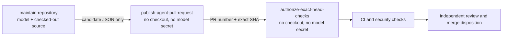

# Hourly OpenCode maintenance

## Purpose

`.github/workflows/hourly-opencode-maintenance.yml` runs at minute 43 of every UTC hour. It uses a checksum-pinned OpenCode 1.18.13 executable and the existing `NVIDIA_NIM_API_KEY` repository secret to repair one dependency-eligible development branch or prepare one bounded buyer-visible improvement.

The workflow is not a reviewer or merger. Independent review, required checks, branch protection, the central CWL review workflows, and deterministic expected-head merge disposition remain authoritative.

## Credential and model boundary

The only model secret referenced by the workflow is:

```text
NVIDIA_NIM_API_KEY
```

It is mapped only inside the model-execution step to:

```text
NVIDIA_API_KEY
```

The selected model is `nvidia/deepseek-ai/deepseek-v4-pro`. There is no GitHub Copilot credential, `COPILOT_GITHUB_TOKEN`, Anthropic or OpenAI key, partner-only endpoint, or automatic provider fallback. A missing NVIDIA credential fails before model execution.

The workflow invokes the plain non-interactive command:

```text
opencode run --model "${MODEL}" --auto
```

It deliberately does not invoke `opencode github run`. OpenCode's GitHub schedule handler can create a pull request itself, which would require giving the model process coarse `pull-requests: write` authority. Plain `opencode run` lets the model edit, test, commit, and push one branch while deterministic non-model jobs own publication and workflow-run authorization.

## Immutable OpenCode installation

| Control | Value |
| --- | --- |
| Schedule | `43 * * * *` |
| OpenCode release | `v1.18.13` |
| Release asset | `opencode-linux-x64.tar.gz` |
| SHA-256 | `8d500b20fed2d26e537e221895b1a575476571b4f0089bb29fb13eeb8eb9e937` |
| Archive shape | exactly one regular-file member named `opencode` |
| Checkout | full-SHA-pinned `actions/checkout` |
| OpenCode timeout | `TERM` after 45 minutes; `KILL` after 30 seconds |
| Job timeout | 50 minutes |
| Overlap | serialized; an active run is not cancelled |

The installer verifies the immutable archive checksum, member count, member name, GNU tar regular-file type, private mode-`0700` extraction directory, overwrite refusal, non-symbolic-link output, and exact executable version before running OpenCode. Checkout keeps `persist-credentials: false`.

## Three-job authority separation



### `maintain-repository`

This is the only job that executes checked-out repository code and OpenCode. Its pull-request permission is read-only:

```text
actions: read
checks: read
contents: write
issues: read
pull-requests: read
security-events: read
statuses: read
```

`contents: write` permits one feature-branch push. `issues: read` permits issue and roadmap inspection only; the model-executing job has no issue mutation authority. Neither permission grants pull-request review or merge endpoints. The model prompt additionally forbids direct pull-request creation, update, approval, closure, or merge, but the permission map—not the prompt—is the primary authorization boundary.

Before OpenCode starts, the job snapshots:

- the `develop` head;
- every same-repository open pull request targeting `develop` and its exact head;
- every existing `automation/opencode-*` branch and its exact head.

After OpenCode exits, the job requires `develop` to remain unchanged and selects at most one candidate:

- one existing pull request whose head moved, retaining both the pre-agent and post-agent exact heads; or
- one new or advanced branch matching `automation/opencode-YYYYMMDDTHHMMSSZ-short-slug`.

Multiple candidates fail closed. No candidate is represented as a no-op, not as successful product development.

### `publish-agent-pull-request`

This job has `contents: read` and the workflow's sole `pull-requests: write` grant. It never checks out or executes repository code and never receives `NVIDIA_API_KEY`.

For an existing pull request, it re-reads and validates repository, base branch, head branch, state, and exact SHA. It then compares the captured pre-agent head with the post-agent head and requires all of the following:

- the post-agent head is a non-destructive descendant with at least one new commit and no commits behind the captured head;
- no more than 50 files changed during the agent update;
- the agent-introduced range contains no `.github/**` or `CODEOWNERS` change.

This range-specific comparison prevents an already-open pull request from bypassing the same policy-file boundary applied to a newly created automation branch. Policy files that existed before the agent run do not authorize the model to modify them during that run.

For a new branch, the publisher requires:

- the strict `automation/opencode-*` namespace;
- the live branch SHA to equal the candidate SHA;
- at least one commit ahead of `develop`;
- no more than 50 changed files;
- no `.github/**` or `CODEOWNERS` change;
- a same-repository branch and `develop` base.

It then creates one draft pull request through a fixed script-generated payload. Commit text may supply the title, but no untrusted source is executed. The job contains no review submission or merge endpoint.

### `authorize-exact-head-checks`

This job has `actions: write`, `contents: read`, and `pull-requests: read`. It never checks out repository code and never receives the model credential. Its only write operation is approval of GitHub Actions workflow runs that GitHub has placed in `action_required` or `waiting` state.

Every eligible run must satisfy all of the following:

1. event is `pull_request`;
2. `head_sha` equals the publisher's exact SHA;
3. the run's `pull_requests` association contains the exact pull-request number;
4. the pull request still has the expected repository, base, head branch, and SHA;
5. the pull request does not change `.github/**` or `CODEOWNERS`.

The pull-request association check matters because two pull requests can reference the same commit SHA. SHA-only filtering could authorize another pull request's waiting workflow.

The job repeatedly discovers and authorizes runs until all of the following names materialize or the bounded wait expires:

```text
CI
Dependency Review
SBOM (CycloneDX)
SAST Semgrep
Security Scan
```

Run authorization starts validation only. It does not make a check successful, approve the pull request, or permit merge.

## Agent development contract

When an eligible pull request exists, OpenCode may update only that same-repository head branch. When none exists, it may create exactly one strict `automation/opencode-*` branch. It must work test-first, preserve 100% configured production statement and branch coverage, add beginner-readable public documentation, update `CHANGELOG.md`, use descriptive multi-word `snake_case` database names, and record current primary standards or peer-reviewed evidence in APA 7th form where material.

The model must not:

- mutate pull-request lifecycle state;
- push to `develop` or `main`;
- bypass checks, reviews, security gates, or branch protection;
- modify the existing review agent or its credential names;
- inspect or disclose secret values;
- modify `.github/**` or `CODEOWNERS` without a specifically authorized automation-maintenance issue;
- publish a release.

## Failure behavior

| Failure | Result |
| --- | --- |
| NVIDIA credential missing | fail before model execution |
| OpenCode archive or checksum mismatch | fail before extraction or execution |
| protected `develop` head moves during the run | fail as indeterminate publication evidence |
| more than one candidate branch or PR changes | fail as ambiguous model output |
| updated PR head is not a non-destructive descendant of its captured head | refuse publication |
| candidate branch is not ahead of `develop` | refuse publication |
| agent-introduced range exceeds 50 files | refuse publication |
| candidate changes `.github/**` or `CODEOWNERS` | require explicit human handling |
| live PR or branch SHA differs from the captured SHA | fail closed |
| workflow run lacks exact PR association | exclude it from authorization |
| required workflow name never materializes | fail and list missing names |
| exact PR head moves during discovery | fail and require re-evaluation |
| any check or independent review fails | leave the PR unmerged |

A failed OpenCode step is preserved as a failed job after candidate evidence is captured. A deterministic publisher may still expose a valid partial branch as a draft for review, but the workflow never calls that a successful maintenance run.

## Rollback

Disable **Hourly OpenCode maintenance** to stop the schedule immediately. Permanent rollback must revert the workflow, contract tests, this operations document, doctoring evidence, design and plan records, and corresponding changelog material through an independently reviewed pull request.

Do not restore `pull-requests: write` to the model job. Do not remove exact pull-request association from workflow-run authorization. Do not remove the pre-agent versus post-agent range check from updated pull requests. A replacement GitHub App or token broker requires separate evidence for endpoint-level capability, actor identity, secret lifecycle, exact-head binding, and independent review.

## Verification checklist

Before merge, verify on the exact head:

- Ubuntu, macOS, and Windows CI succeed;
- dependency review, SBOM, Semgrep, Trivy, OSV, Scorecard, and required security gates succeed;
- all current review threads are resolved;
- a non-author approval is anchored to the exact current SHA;
- only `NVIDIA_NIM_API_KEY` is referenced as a model secret;
- the immutable OpenCode archive and action pins remain unchanged;
- the model job has `pull-requests: read`, not write;
- the model job has `issues: read`, not write;
- the publisher is the only holder of `pull-requests: write` and performs no checkout;
- updated existing pull requests retain their captured pre-agent head and reject destructive ancestry, more than 50 agent-introduced files, `.github/**`, and `CODEOWNERS` changes;
- new branches reject more than 50 files, `.github/**`, and `CODEOWNERS` changes;
- the authorizer is the only holder of `actions: write` and performs no checkout;
- every authorized run is associated with the exact pull-request number and SHA;
- the workflow contains no pull-request review or merge operation.

## References — APA 7th

Anomaly. (2026). *GitHub handler (Version 1.18.13)* [Source code]. GitHub. https://github.com/anomalyco/opencode/blob/v1.18.13/packages/opencode/src/cli/cmd/github.handler.ts

Anomaly. (2026). *Run command (Version 1.18.13)* [Source code]. GitHub. https://github.com/anomalyco/opencode/blob/v1.18.13/packages/opencode/src/cli/cmd/run.ts

Anomaly. (2026). *OpenCode release v1.18.13* [Software release]. GitHub. https://github.com/anomalyco/opencode/releases/tag/v1.18.13

Free Software Foundation. (2023). *GNU tar 1.35: Security*. https://www.gnu.org/software/tar/manual/html_section/Security.html

GitHub, Inc. (2026). *GITHUB_TOKEN*. GitHub Docs. https://docs.github.com/en/actions/concepts/security/github_token

GitHub, Inc. (2026). *REST API endpoints for workflow runs*. GitHub Docs. https://docs.github.com/en/rest/actions/workflow-runs

GitHub, Inc. (2026). *Security hardening for GitHub Actions*. GitHub Docs. https://docs.github.com/en/actions/security-for-github-actions/security-guides/security-hardening-for-github-actions

NVIDIA Corporation. (2026). *DeepSeek V4 Pro*. NVIDIA NIM API catalog. https://build.nvidia.com/deepseek-ai/deepseek-v4-pro
