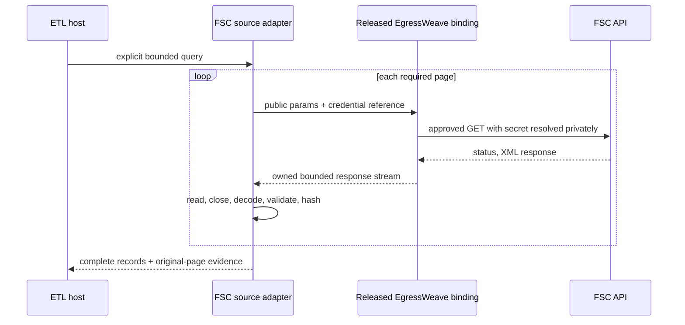

# Stock-data source specification and usage

Status: implemented candidate, not released or live-provider verified. See [ADR](../adr/stock_data_source_boundary.md) and [gap baseline](../product-technical-gap-baseline.md).

## Product requirement

An ETL host can request published Korean stock observations for an explicit reference day or date range, optionally limited to one ISIN, and receive a complete typed batch with original response evidence. A failed or oversized page must not look like a successful partial historical dataset. The user must be able to distinguish reference date, collection time, empty source output and realtime data.

This first provider is FSC `GetStockSecuritiesInfoService/getStockPriceInfo`. ETF, index, fundamentals, tick/order-book, trading/order APIs, adjusted total-return series and other countries are not implemented. New provider adapters must preserve their own publication and adjustment semantics rather than silently substitute feeds.

## Java integration

The package is `com.xtrmetl.etl.stock_data` in the existing `etl-service` module. It is not a separately published Maven artifact yet.

```java
public FscStockDataSource.StockBatch loadPublishedStockDay(
        StockDataTransport approvedTransport, Clock observationClock) {
    var stockSource = new FscStockDataSource(
            approvedTransport, "fsc_stock_key", observationClock);
    var stockQuery = new FscStockDataSource.StockQuery(
            LocalDate.of(2026, 9, 4), LocalDate.of(2026, 9, 4),
            "KR7005930003", 1000, 100, 10000);
    return stockSource.collectStockData(stockQuery);
}
```

This is host integration code, not a self-contained live example: `approvedTransport` must be an actual reviewed, released EgressWeave binding. `fsc_stock_key` is an opaque deployment reference, not an API key. No such concrete Java/Rust binding is claimed shipped here; [EgressWeave #246](https://github.com/ContextualWisdomLab/EgressWeave/issues/246) owns it. Never replace it with arbitrary Java HTTP/curl/Python fetching in the consumer. The model/agent never receives key material.

Public page parameters use `basDt` for one day or `beginBasDt`/`endBasDt` for a range, optional `isinCd`, plus `pageNo`, `numOfRows` and `resultType=xml`. The endpoint has no query string. XML is selected to use the existing JDK without a new parser dependency. The transport owns key encoding, HTTP framing/decompression, inactivity budgets, retries at the job boundary and shared provider quotas. The collector performs sequential requests and no retry; `rate_limited` requires the host to respect provider policy before a new collection attempt.

## Field and provenance contract

| FSC field | Typed result | Meaning retained |
|---|---|---|
| `basDt` | `referenceDate` | provider reference date, not publication/collection time |
| `srtnCd` | `shortCode` | exact text including leading zeroes |
| `isinCd` | `isinCode` | provider ISIN, grammar-checked, not checksum-certified |
| `itmsNm`, `mrktCtg` | `instrumentName`, `marketCategory` | provider labels, not guessed MICs |
| `mkp`, `hipr`, `lopr`, `clpr` | open/high/low/close `BigDecimal` | no binary floating point or two-decimal rounding |
| `trqu`, `trPrc` | `BigInteger` volume/value | exact integers, including values above 2^53 |
| remaining row fields | immutable `sourceFields` | bounded XML text with surrounding whitespace stripped; exact bytes remain in raw pages |

Every batch retains the request, immutable observations and raw pages. Each raw page has `pageNumber`, `collectedAt`, exact bytes and their SHA-256. Preserve those bytes in an authorized archive before discarding the batch when durable replay is required. Returning a digest does not itself create durable storage or lineage publication. No request URL with `serviceKey` enters this evidence. Undeclared or duplicate children in `response`, `header`, or `body` fail the page; `item` fields may still carry provider-defined names. Cancellation after body read, after decode, or immediately before returning a batch yields `cancelled` rather than a completed result.

## Failure and operating behavior

`StockDataException.errorCode()` is one of `invalid_query`, `transport_failure`, `cancelled`, `rate_limited`, `provider_rejected`, `invalid_content_type`, `invalid_xml`, `invalid_page`, `invalid_record`, `incomplete_result`, `duplicate_record`, `body_too_large` or `digest_unavailable`. Errors contain no provider message, source row, request credential, cause or suppressed exception.

A zero-row successful response produces `empty_source_result`; it does not certify a holiday, a future date, an unpublished day or nonexistent instrument. Populated results produce `complete`, meaning the response count/pagination contract passed. It does not certify source correctness, transactional snapshot consistency or exchange completeness. A single inconsistent row causes whole-call failure; archive/reconciliation policy belongs to the host, not silent row dropping.

The adapter retains provider zero values and does not invent a trading-halt status. A zero-trade row whose open/high/low are all zero is allowed even when the provider carries forward a nonzero close. Corporate actions, split adjustments, suspension calendars, survivorship bias and historical availability remain separate domain responsibilities.

## Sequence and acceptance



The transport participant is the required owner contract, not an implemented service in this PR. There is no database migration or ERD delta. Each invocation's batch is the minimum all-or-error application boundary.

Focused verification uses the same dependency-free contract suite as JUnit:

```sh
sh scripts/verify_stock_data_source.sh
./mvnw -B -pl etl-service -am test
```

The first command compiles the new source with warnings as errors, runs synthetic unit assertions and generates Javadoc with warnings as errors. The second is the existing Maven reactor integration gate. Neither command makes a live API call. Do not replace the full repository CI or claim a fixture test is live conformance.
