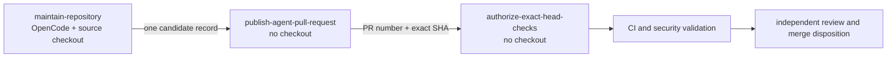

# Hourly OpenCode Maintenance Agent Design

## Purpose

mightyETL requires an hourly development loop that can inspect the live pull-request queue, repair one dependency-eligible branch, or prepare one bounded buyer-visible improvement without granting model-generated code review, merge, or workflow-administration authority.

The model credential is `NVIDIA_NIM_API_KEY`. GitHub Copilot credentials and changes to the existing review agents are outside this design.

## Architecture decision

Use three physically separated GitHub Actions jobs:



### Model execution job

`maintain-repository` uses plain `opencode run`, not `opencode github run`. The GitHub lifecycle handler can create pull requests and therefore requires pull-request write authority. Plain run separates model execution from PR publication.

The job receives:

```text
actions: read
checks: read
contents: write
issues: write
pull-requests: read
security-events: read
statuses: read
```

It may inspect pull requests and push one feature branch. It cannot create, update, approve, close, or merge a pull request with its token.

### Deterministic publisher

`publish-agent-pull-request` has `contents: read` and `pull-requests: write`. It has no checkout, model credential, or repository-code execution. It validates one candidate and either identifies an already-open updated PR or creates one draft PR from a strict `automation/opencode-*` branch.

### Workflow-run authorizer

`authorize-exact-head-checks` has `actions: write`, `contents: read`, and `pull-requests: read`. It has no checkout or model credential. It may approve only workflow runs that are:

- `pull_request` events;
- bound to the exact expected SHA;
- associated with the exact expected pull-request number;
- in `action_required` or `waiting` state.

It does not approve a PR or merge code.

## Schedule and supply-chain contract

- cron: `43 * * * *`;
- no manual dispatch;
- serialized concurrency;
- immutable `actions/checkout` full SHA;
- `persist-credentials: false`;
- OpenCode 1.18.13 immutable Linux archive;
- SHA-256 `8d500b20fed2d26e537e221895b1a575476571b4f0089bb29fb13eeb8eb9e937`;
- exactly one regular archive entry named `opencode`;
- private mode-`0700` extraction without archived ownership or permissions;
- 45-minute `TERM`, 30-second `KILL` escalation, 50-minute job timeout;
- model `nvidia/deepseek-ai/deepseek-v4-pro` with no provider fallback.

## Candidate-state contract

Before OpenCode starts, snapshot:

1. protected `develop` head;
2. every same-repository open `develop` PR and head SHA;
3. every existing `automation/opencode-*` branch and head SHA.

After OpenCode exits:

1. require `develop` to be unchanged;
2. identify existing PR heads changed during the run;
3. identify new or advanced strict automation branches;
4. exclude an automation branch already represented by the changed PR candidate;
5. require zero or one candidate;
6. fail if the output is ambiguous.

A new branch must match:

```text
^automation/opencode-[0-9]{8}T[0-9]{6}Z-[a-z0-9][a-z0-9-]{0,48}$
```

The publisher additionally requires a live matching SHA, at least one commit ahead of `develop`, at most 50 changed files, and no `.github/**` or `CODEOWNERS` path.

## Exact-head workflow contract

GitHub creates pull-request workflows asynchronously. The authorizer performs bounded repeated discovery and succeeds only when all five names are associated with the exact PR number and SHA:

```text
CI
Dependency Review
SBOM (CycloneDX)
SAST Semgrep
Security Scan
```

A SHA-only filter is insufficient because multiple pull requests can reference the same commit. Every selected workflow run must satisfy:

```text
run.head_sha == expected_head
and any(run.pull_requests; number == expected_pull_request_number)
```

The live PR head is checked before discovery, on every discovery pass, and after the complete set materializes.

## Git credential lifecycle

The model job uses an ephemeral repository-local `!gh auth git-credential` helper because checkout credentials remain disabled. It clears inherited local helpers, configures the bot author, and removes the helper through an `EXIT` trap after success, failure, or timeout. No token is written into Git configuration.

## Agent product contract

When a dependency-eligible PR exists, the model may update only that branch. Otherwise it may push exactly one strict automation branch. It must work test-first, preserve configured production statement and branch coverage at 100%, maintain public documentation and `CHANGELOG.md`, use descriptive multi-word `snake_case` database names, and record material primary standards or peer-reviewed evidence in APA 7th form.

The model may not mutate PR lifecycle state, protected branches, workflow policy, review-agent credentials, repository secrets, or releases.

## Failure semantics

Missing credentials, archive mismatch, model failure, protected-branch movement, multiple candidates, invalid branch namespace, policy-file changes, candidate SHA movement, absent workflow association, incomplete workflow-name materialization, or any rejected API mutation fails visibly. Partial branch evidence can be exposed only as a draft by the deterministic publisher; it is not reported as a successful run.

## Verification

Tests must prove:

- hourly bounded execution and immutable installation;
- exclusive NVIDIA NIM model credential;
- plain OpenCode run instead of GitHub lifecycle execution;
- PR read-only authority in the model job;
- exactly one non-checkout PR publisher;
- exactly one non-checkout Actions authorizer;
- strict single-candidate publication;
- policy-file exclusion;
- exact PR-number plus SHA run association;
- complete five-workflow materialization;
- no PR review or merge endpoint in the workflow.

## References — APA 7th

Anomaly. (2026). *GitHub handler (Version 1.18.13)* [Source code]. GitHub. https://github.com/anomalyco/opencode/blob/v1.18.13/packages/opencode/src/cli/cmd/github.handler.ts

Anomaly. (2026). *Run command (Version 1.18.13)* [Source code]. GitHub. https://github.com/anomalyco/opencode/blob/v1.18.13/packages/opencode/src/cli/cmd/run.ts

GitHub, Inc. (2026). *GITHUB_TOKEN*. GitHub Docs. https://docs.github.com/en/actions/concepts/security/github_token

GitHub, Inc. (2026). *REST API endpoints for workflow runs*. GitHub Docs. https://docs.github.com/en/rest/actions/workflow-runs

NVIDIA Corporation. (2026). *DeepSeek V4 Pro*. NVIDIA NIM API catalog. https://build.nvidia.com/deepseek-ai/deepseek-v4-pro
