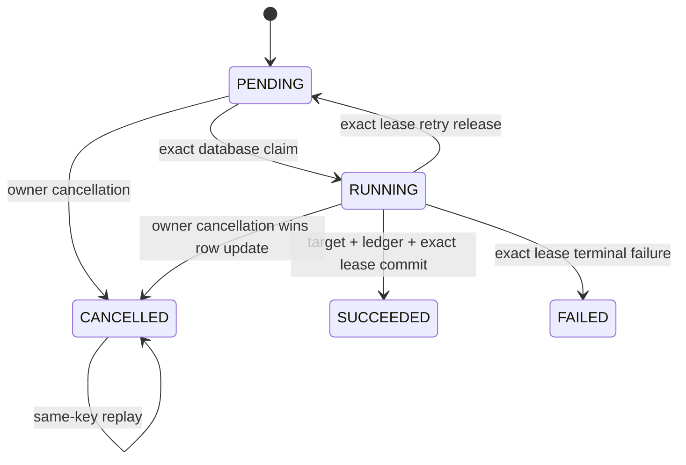

# Durable ETL Job Cancellation Design

## Purpose

mightyETL already accepts, executes, discovers, polls, and conditionally validates durable ETL jobs. Enterprise operators also need to stop work that is no longer wanted without leaking cross-tenant existence, weakening lease fencing, or claiming that a cancellation succeeded before the database transition committed.

This design adds an authenticated owner-scoped cancellation action and one terminal `CANCELLED` lifecycle state. The first slice is deliberately limited to target effects that participate in the same transaction as the durable response ledger and terminal job transition.

## API contract

```http
POST /api/etl/jobs/{job_record_id}/cancellation
Authorization: <existing authenticated principal>
Idempotency-Key: "client-generated-safe-key"
```

A successful first cancellation returns `200 OK`, the existing operator-safe status representation, `Cache-Control: no-store`, a weak `ETag`, and:

```http
Idempotency-Replayed: false
```

Repeating the same principal, job identifier, and normalized cancellation key returns the same cancelled resource with `Idempotency-Replayed: true`.

No request body or free-text reason is accepted in the first slice. This prevents unbounded sensitive text from entering persistence, logs, metrics, or problem details.

## State machine



`SUCCEEDED`, `FAILED`, and `CANCELLED` are terminal. A cancellation request against `SUCCEEDED` or `FAILED` returns an RFC 9457 problem with `409 Conflict`; it never rewrites a completed outcome.

## Database authority

One conditional `UPDATE` is the cancellation authority:

```sql
UPDATE etl_job_records
SET job_status = 'CANCELLED',
    request_payload = NULL,
    failure_code = NULL,
    lease_claim_id = NULL,
    lease_owner_id = NULL,
    lease_expires_at = NULL,
    cancellation_key_hash = ?,
    cancellation_code = 'etl_job_cancelled_by_owner',
    job_cancelled_at = CURRENT_TIMESTAMP,
    updated_at = CURRENT_TIMESTAMP
WHERE job_record_id = ?
  AND principal_scope_hash = ?
  AND job_status IN ('PENDING', 'RUNNING');
```

The update count determines whether cancellation won. PostgreSQL row-update locking serializes competing writers. A follow-up owner-scoped read classifies a zero-row result as same-key replay, conflicting cancellation key, already-succeeded, already-failed, or owner-safe not-found. Read-then-write logic is never the authority.

## Race outcomes

### Cancellation commits first

```text
owner cancellation updates PENDING or RUNNING to CANCELLED
→ payload and lease fields are cleared atomically
→ worker markSucceeded exact-live-lease predicate updates zero rows
→ StaleEtlJobLeaseException aborts the worker transaction
→ target and response-ledger writes roll back
→ final state CANCELLED
```

### Success commits first

```text
worker target + response ledger + SUCCEEDED commit
→ cancellation conditional update affects zero rows
→ owner-scoped read observes SUCCEEDED
→ API returns 409 etl_job_already_succeeded
→ final state SUCCEEDED
```

Exactly one terminal outcome wins.

## Persistence contract

Migration `V6__add_etl_job_cancellation.sql` adds:

- `cancellation_key_hash CHAR(64)`;
- `cancellation_code VARCHAR(128)`;
- `job_cancelled_at TIMESTAMPTZ`.

All names contain multiple descriptive words and use `snake_case`.

The migration replaces lifecycle constraints so that:

- `CANCELLED` is a valid status;
- `PENDING` and `RUNNING` retain a non-null payload;
- `SUCCEEDED`, `FAILED`, and `CANCELLED` have a null payload;
- only `RUNNING` has lease fields;
- only `FAILED` has `failure_code`;
- only `CANCELLED` has all three cancellation fields;
- cancellation and identity hashes remain lowercase 64-character SHA-256 text.

Raw principals and raw cancellation keys are never persisted.

## Error taxonomy

| HTTP | Stable code | Meaning |
| ---: | --- | --- |
| 400 | `etl_job_cancellation_key_required` | The key is absent or outside the supported bounded profile. |
| 404 | `etl_job_not_found` | The identifier is malformed, missing, or foreign-owned. |
| 409 | `etl_job_cancellation_in_progress` | An eligible row remained non-terminal after a failed authoritative update. |
| 409 | `etl_job_already_succeeded` | Success committed before cancellation. |
| 409 | `etl_job_already_failed` | Failure committed before cancellation. |
| 422 | `etl_job_cancellation_key_reused` | A cancelled job is replayed with a different cancellation key. |

Problem responses use the existing RFC 9457 `application/problem+json` handler and contain no SQL, stack trace, exception message, principal, key, hash, payload, lease identifier, or target identity.

## HTTP representation and caching

The existing status representation remains the wire model. `jobStatus=CANCELLED` and the updated timestamp communicate the terminal outcome without exposing the cancellation key hash or internal code. The status `ETag` already covers lifecycle state and update time, so a committed cancellation invalidates every earlier validator. `Retry-After` remains absent because the polling advice emits it only for active states.

## Observability

The endpoint is annotated with the fixed observation name `etl.jobs.cancel`. No user-controlled tag is added. A successful response means the authoritative cancellation transition committed or an identical cancellation replay was proven; request acceptance alone is never reported as success.

## Verification

The exact-head suite must prove:

1. pending cancellation prevents a later claim and clears the payload;
2. running cancellation clears lease fields and makes exact-lease success stale;
3. same-key cancellation replays one cancelled resource;
4. a different key fails with `etl_job_cancellation_key_reused`;
5. foreign-owned and missing identifiers share `etl_job_not_found`;
6. success-before-cancellation and failure-before-cancellation return stable conflicts;
7. malformed and absent keys fail before database access;
8. controller success, replay, authentication, malformed identifier, typed failure, database failure, and unexpected failure paths are covered;
9. `CANCELLED` receives no `Retry-After`;
10. conditional status validation changes after cancellation;
11. migration lifecycle, naming, privacy, and rollback documentation are tested;
12. every added production statement and branch remains covered with no skipped project test.

## Operational limitation

Cancellation invalidates the durable database lease and prevents transactional effects from committing. It does not forcibly terminate arbitrary computation. A connector whose target effects cannot join the mightyETL database transaction requires a separately designed compensation or connector-native cancellation contract before mightyETL may claim equivalent safety.

## Rollback

Application rollback must stop serving the cancellation endpoint before schema rollback. Retain the `CANCELLED` vocabulary while any cancelled row exists. A controlled data migration may archive cancelled rows before dropping cancellation columns and restoring older constraints. Never map cancelled rows to `FAILED` or `SUCCEEDED` silently.

## References — APA 7th

Fielding, R., Nottingham, M., & Reschke, J. (2022). *HTTP semantics* (RFC 9110). RFC Editor. https://www.rfc-editor.org/rfc/rfc9110

Nottingham, M., Wilde, E., & Dalal, S. (2023). *Problem details for HTTP APIs* (RFC 9457). RFC Editor. https://www.rfc-editor.org/rfc/rfc9457

PostgreSQL Global Development Group. (2026). *PostgreSQL 18 documentation: Data consistency checks at the application level*. https://www.postgresql.org/docs/18/applevel-consistency.html

PostgreSQL Global Development Group. (2026). *PostgreSQL 18 documentation: UPDATE*. https://www.postgresql.org/docs/18/sql-update.html
