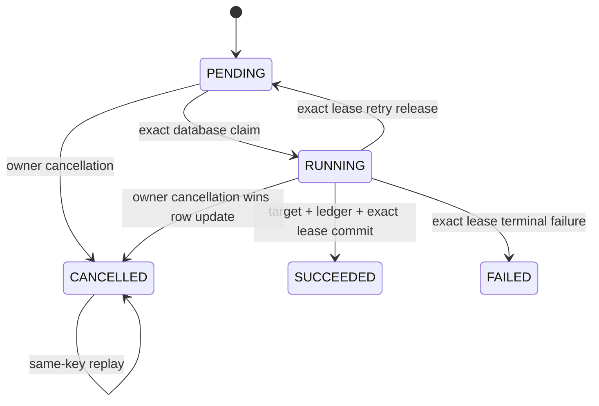

# Durable ETL Job Cancellation Design

## Purpose

mightyETL durable jobs need an operator-controlled stop action that preserves owner isolation, idempotent replay, database lease fencing, and truthful transactional guarantees. Cancellation is therefore modeled as a database-owned terminal transition, not as a best-effort thread interrupt.

## API contract

```http
POST /api/etl/jobs/{job_record_id}/cancellation
Authorization: <existing authenticated principal>
Idempotency-Key: "client-generated-safe-key"
```

A successful first cancellation returns the existing operator-safe status representation, `200 OK`, `Cache-Control: no-store`, a weak `ETag`, and `Idempotency-Replayed: false`. The same principal, job, and normalized key replays the terminal resource with `Idempotency-Replayed: true`.

## State machine



`SUCCEEDED`, `FAILED`, and `CANCELLED` are terminal. Exactly one terminal outcome wins. Completed success or failure is never rewritten as cancellation.

## Database authority

One conditional `UPDATE` is the cancellation authority:

```sql
UPDATE etl_job_records
SET job_status = 'CANCELLED',
    request_payload = NULL,
    failure_code = NULL,
    lease_claim_id = NULL,
    lease_owner_id = NULL,
    lease_expires_at = NULL,
    cancellation_key_hash = ?,
    cancellation_code = 'etl_job_cancelled_by_owner',
    job_cancelled_at = CURRENT_TIMESTAMP,
    updated_at = CURRENT_TIMESTAMP
WHERE job_record_id = ?
  AND principal_scope_hash = ?
  AND job_status IN ('PENDING', 'RUNNING');
```

The affected-row count determines whether cancellation committed. A zero-row update is classified only by an owner-scoped read as same-key replay, conflicting key, already succeeded, already failed, concurrent active transition, or owner-safe not found. Read-then-write logic is not cancellation authority.

## Replay identity

Raw principals and raw cancellation keys are never persisted. Replay identity uses an explicit versioned cancellation domain together with the authenticated-principal hash, job identifier, and normalized key. The same-key replay is deterministic for one principal/job while the same client key on another job or principal produces a distinct stored identity.

## Race and transaction semantics

When cancellation commits first, it clears the live lease. A former worker can continue computing in memory, but its exact-live-lease success transition must affect zero rows and raise `StaleEtlJobLeaseException`. Transactional target effects and the durable response ledger then roll back with that worker transaction.

When success commits first, cancellation affects zero rows, the owner-scoped terminal read observes `SUCCEEDED`, and the API returns `409 etl_job_already_succeeded`. The corresponding failed-job race returns `409 etl_job_already_failed`.

The phrase transactional target effects is deliberate: this guarantee covers effects participating in the same transaction as the job-state and response-ledger commit. Remote warehouses, file uploads, external APIs, and message brokers require connector-native idempotency, cancellation, or compensation before equivalent rollback can be claimed.

## HTTP representation

The wire representation exposes `jobStatus=CANCELLED` without exposing cancellation hashes, codes, raw keys, principals, payloads, or lease identifiers. Cancellation changes lifecycle state and update time, so the weak status `ETag` changes. `CANCELLED` is terminal and therefore never retains `Retry-After` polling guidance.

## Persistence and migration

`V6__add_etl_job_cancellation.sql` adds descriptive multi-word `snake_case` columns `cancellation_key_hash`, `cancellation_code`, and `job_cancelled_at`. Lifecycle checks require payloads only while work is active, leases only while `RUNNING`, failure metadata only for `FAILED`, and cancellation metadata only for `CANCELLED`.

The migration is immutable once applied. Rollback must first stop serving cancellation, preserve or archive cancelled-row evidence, and use a new reviewed migration. Never silently map `CANCELLED` to `FAILED` or `SUCCEEDED`.

## Error taxonomy

- `400 etl_job_cancellation_key_required`: missing or invalid key.
- `404 etl_job_not_found`: malformed, missing, or foreign-owned identifier.
- `409 etl_job_cancellation_in_progress`: an eligible transition remained unresolved after the authoritative update.
- `409 etl_job_already_succeeded`: success won the race.
- `409 etl_job_already_failed`: failure won the race.
- `422 etl_job_cancellation_key_reused`: a different key addresses an already-cancelled job.

Problem responses use the existing RFC 9457 handler and never disclose SQL, exception text, principal identity, keys, hashes, payloads, or leases.

## Verification contract

Exact-head verification must prove pending and running cancellation, payload and lease clearing, same-key replay, different-key rejection, owner isolation, completed-state conflicts, malformed input, controller failure mapping, stale-lease fencing, cancellation polling terminality, conditional-validator change, migration invariants, and rollback documentation. Added production statements and branches remain fully covered.

## References — APA 7th

Fielding, R., Nottingham, M., & Reschke, J. (2022). *HTTP semantics* (RFC 9110). RFC Editor. https://www.rfc-editor.org/rfc/rfc9110

Nottingham, M., Wilde, E., & Dalal, S. (2023). *Problem details for HTTP APIs* (RFC 9457). RFC Editor. https://www.rfc-editor.org/rfc/rfc9457

PostgreSQL Global Development Group. (2026). *PostgreSQL 18 documentation: UPDATE*. https://www.postgresql.org/docs/18/sql-update.html
